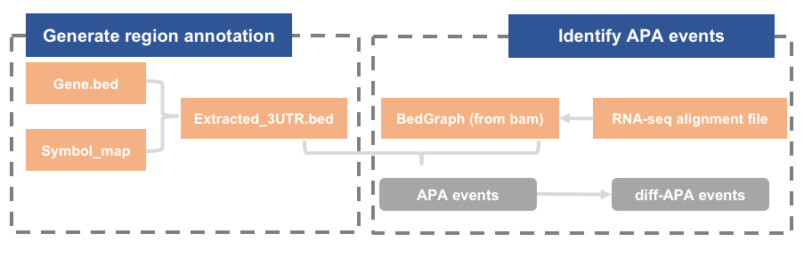
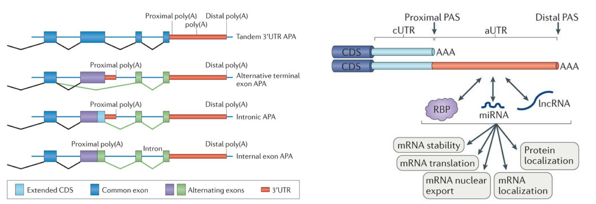
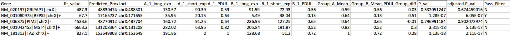

## 可变多聚腺苷酸化（Alternative polyadenylation）
### workflow

### Background
Alternative polyadenylation (APA) leading to the production of two mRNA isoforms with different 3ʹ untranslated regions (3ʹ UTRs)The dynamic usage of the 3’untranslated region (3’UTR) resulting from alternative polyadenylation (APA) is emerging as a pervasive mechanism for regulating mRNA diversity, stability and translation. 

### Data Processing
#### DaPars
##### step1. Generate region annotation: python DaPars_Extract_Anno.py -b gene.bed -s symbol_map.txt -o extracted_3UTR.bed
DaPars will use the extracted distal polyadenylation sites to infer the proximal polyadenylation sites based on the alignment wiggle files of two samples. The output in this step will be used by the next step.

```
python DaPars_Extract_Anno.py -b hg19_refseq_whole_gene.bed -s hg19_4_19_2012_Refseq_id_from_UCSC.txt -o hg19_refseq_extracted_3UTR.bed

```
###### input
###### output

##### step2. Main function to get final result: python DaPars_main.py configure_file
Run this function to get the final result. The configure file is the only parameter for DaPars_main.py, which stores all the parameters.
The format of the configure is:
```
#The following file is the result of step 1.

Annotated_3UTR=hg19_refseq_extracted_3UTR.bed

#A comma-separated list of BedGraph files of samples from condition 1

Group1_Tophat_aligned_Wig=Condition_A_chrX.wig
#Group1_Tophat_aligned_Wig=Condition_A_chrX_r1.wig,Condition_A_chrX_r2.wig if multiple files in one group

#A comma-separated list of BedGraph files of samples from condition 2

Group2_Tophat_aligned_Wig=Condition_B_chrX.wig

Output_directory=DaPars_Test_data/

Output_result_file=DaPars_Test_data

#At least how many samples passing the coverage threshold in two conditions
Num_least_in_group1=1

Num_least_in_group2=1

Coverage_cutoff=30

#Cutoff for FDR of P-values from Fisher exact test.

FDR_cutoff=0.05


PDUI_cutoff=0.5

Fold_change_cutoff=0.59
```
###### input
###### output


##### step3. Filter diff-APA events
###### input
###### output

