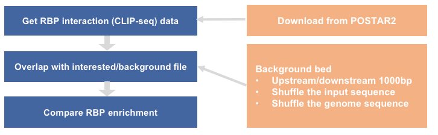
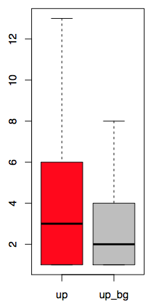

### workflow


### 1. get CLIP-seq data
#### 1.1 download from http://lulab.life.tsinghua.edu.cn/postar/download.php
#### 1.2 get from /BioII/lulab_b/shared/projects/POSTAR2/CLIP_seq/bed
human_RBP_eCLIP_hg38.txt 
```
chr1    187044  187087  human_RBP_eCLIP_ENCODE_1        0       -       AARS    eCLIP   K562    ENCODE  3.02982873699729
chr1    267418  267466  human_RBP_eCLIP_ENCODE_2        0       -       AARS    eCLIP   K562    ENCODE  5.50800008227284
chr1    630751  630792  human_RBP_eCLIP_ENCODE_3        0       -       AARS    eCLIP   K562    ENCODE  3.5454755693998
```
explanation for each column
```
column1:chromosome
column2:peak start 
column3:peak end
column4:name
column5:0
column6:strand
column7:RBP name
column8:CLIP-seq technology, peak calling method
column9:cell line or tissue
column10:data accession
column11:score(Piranha score: Peak heights from the CLIP-seq data; PARalyzer score: T-to-C transition ratios ranging from 0 to 1, ratios greater than 0.5 indicate protein-binding while less than 0.5 indicate without protein-binding; CIMS score: Mismatch peak heights from the CLIP-seq data; CITS score: Truncated peak heights from the CLIP-seq data; eCLIP score: -log10 P-value, the threshold is 3.)
```
### 2. prepare interested bed and background bed
#### 2.1 interested bed
up.bed 
```
chr1    1167104 1167134 ENSG00000207730.3__1167104__1167134__1  .       +
chr1    1167119 1167149 ENSG00000207730.3__1167119__1167149__2  .       +
chr1    1167134 1167164 ENSG00000207730.3__1167134__1167164__3  .       +
```
#### 2.2 prepare background bed from interested bed
the same as method in sequence_motif
(1) downstream/upstream 1000bp
(2) shuffle the input sequence
(3) shuffle the genome sequence

### 3. overlap between CLIP-seq peaks and interested/background bed
use intersectBed (bedtools) command to get the overlaps of CLIP-seq peaks 
```
intersectBed -wa -wb -s -a up.bed -b human_RBP_eCLIP_hg38.txt >up.eCLIP.hg38.txt
intersectBed -wa -wb -s -a up_background.bed -b human_RBP_eCLIP_hg38.txt >up_background.eCLIP.hg38.txt
```
### 4. compare RBP enrichment
#### 4.1 percentage of region with CLIP-seq peaks
```
cut -f 4 up.bed |sort -u|wc -l
1685
cut -f 4 up.eCLIP.hg38.txt |sort -u|wc -l
663
cut -f 4 up_background.bed |sort -u|wc -l
1685
cut -f 4 up_background.eCLIP.hg38.txt |sort -u|wc -l
544
```
#### 4.2 RBP enrichment in each region

```
cat <(cut -f 4,13 up.eCLIP.hg38.txt |sort -u|cut -f 1|sort|uniq -c|sed 's/^[ \t]*//g'|sed 's/ /\t/g'|awk 'BEGIN{FS="\t";OFS="\t"}{print $1,$2,"up"}') <(cut -f 4,13 up_background.eCLIP.hg38.txt |sort -u|cut -f 1|sort|uniq -c|sed 's/^[ \t]*//g'|sed 's/ /\t/g'|awk 'BEGIN{FS="\t";OFS="\t"}{print $1,$2,"up_bg"}')|sed '1i density\tname\tclass' >RBP_enrichment.txt
```
screen short of "RBP_enrichment.txt"
```
density name    class
1       ENSG00000004897.11__47141883__47141913__96      up
2       ENSG00000104723.20__15540418__15540448__14      up
2       ENSG00000115758.12__10441554__10441584__100     up
```
boxplot of RBP enrichment

