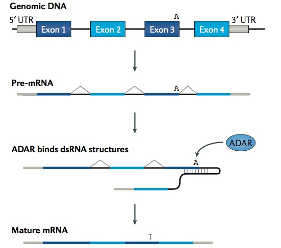
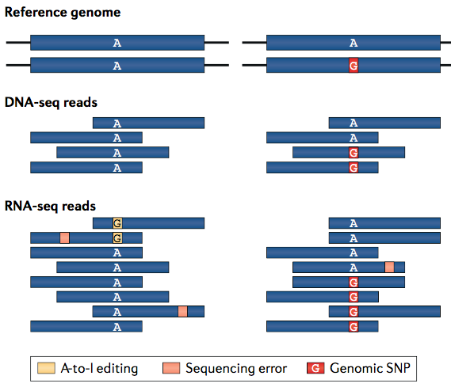
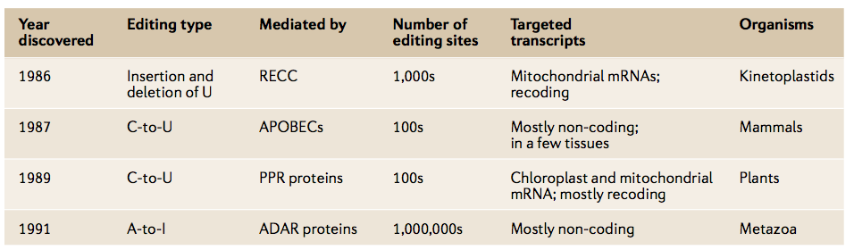
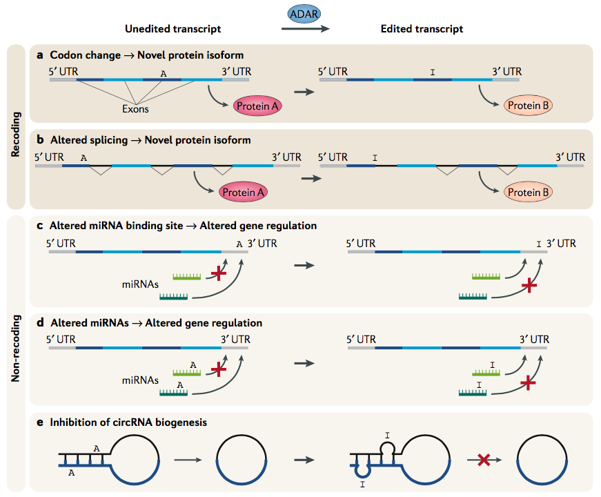
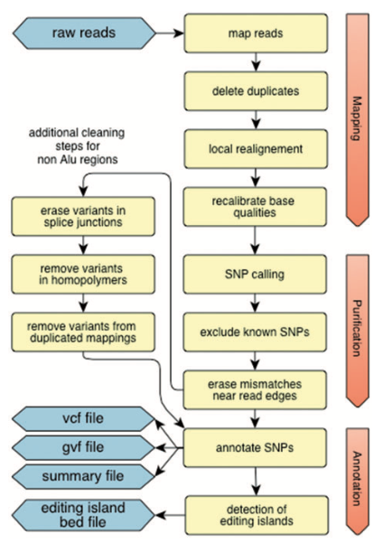
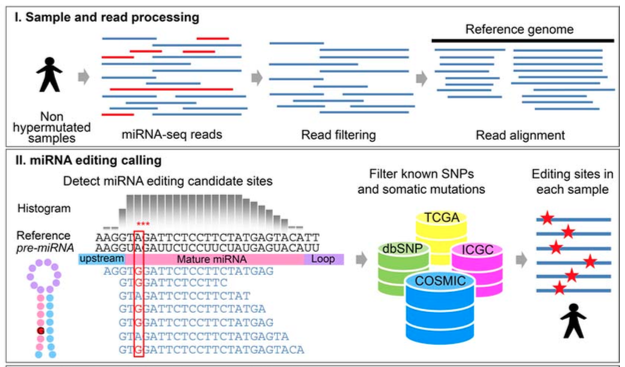

## RNA editing
### Background
Pre-mRNA molecules transcribed from the genome may fold to form double-stranded RNA (dsRNA) secondary structures. dsRNA-specific adenosine deaminase (ADAR) enzymes bind these structures and deaminate some adenosines to inosines. If these inosines are located in an exon, they will be present in the mature mRNA.



Reverse transcription replaces inosines in mRNA with guanosines in the cDNA. Thus, the hallmark of RNA editing is a consistent A → G mismatch between RNA sequencing (RNA-seq) data and the reference genomic sequence to which it is aligned.



Four main types of mRNA editing have been studied in recent decades. A-to-I RNA editing is the most common in terms of the range of organisms affected, the breadth of tissues edited and the number of editing sites.



Editing can modify protein function, generate new protein products and alter gene regulation.



### long RNA-seq
#### RNAEditor
##### Paper
RNAEditor: easy detection of RNA editing events and
the introduction of editing islands
##### pipeline

##### Website
http://rnaeditor.uni-frankfurt.de/index.php

##### Pipeline
```
RNAEditor -i Fastq-Files [Fastq-Files ...] -c Configuration File
```
### small RNA-seq
##### Paper
Identifying RNA Editing Sites in miRNAs by Deep Sequencing

##### pipeline


##### Website
https://www.tau.ac.il/~elieis/miR_editing/

##### Pipeline
step1. Filtering Low- Quality Reads and Trimming Sequence Adapters
```
perl Process_reads.pl Input_fastq_file The_filtered_fastq_file
```
step2. Aligning the reads against the genome
```
bowtie -n 1 -e 50 -a -m 1 --best --strata --trim3 2 The_bowtie_folder/The_genome_indexes The_filtered_fastq_file > The_output_file
```
step3. Mapping the mismatches against the pre-miRNA sequences
```
perl Analyze_mutation.pl The_output_file main_output.txt
```
step4. Using binomial statistics to remove sequencing errors
```
perl Binomial_analysis.pl main_output.txt >binomial_output.txt
```
### citation
1. A-to-I RNA editing — immune protector and transcriptome diversifier. Eli Eisenberg, et al. Nature Reviews, 2018.

2. RNAEditor: easy detection of RNA editing events andthe introduction of editing islands. David John, et al. Briefings in Bioinformatics, 2017.

3. Systematic characterization of A-to-I RNA editing hotspots in microRNAs across human cancers. Yumeng Wang, et al. Genome Research, 2017. 

4. Identifying RNA Editing Sites in miRNAs by Deep Sequencing. Alon S, et al. Methods Mol Biol.2013.
