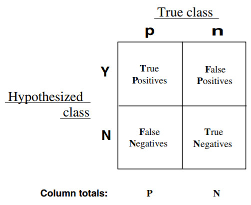
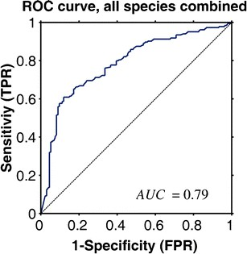
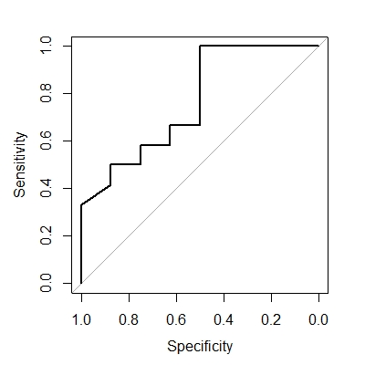
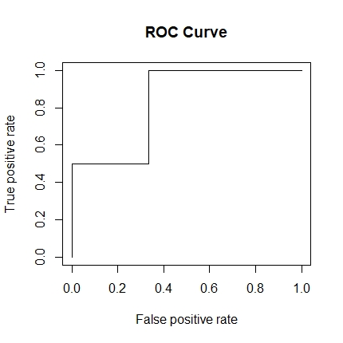

# ROC Curve

## Introduction
__ROC(Receiver Operating Characteristic) curve__, 受试者工作特征曲线 in Chinese, is a useful tool for organizing classifiers and visualizaing their performance. It is first developed by electrical engineers and radar engineers in the World War II, which was used to detect enemy object. Since then, it has been widely used in several occasions.

The ROC curve is designed to __evaluate performance of classifier__ based on models. For a given set of sample, we can know that each instance can be mapped to a certain class, whether p or n. In the case of exRNA study, p means this sample is from someone who has cancer and n means this person does not. Classifier based on certain model will map each instance another class, whether Y or N(to distinguish from the real class). In the study of exRNA, Y means that the model shows this person has cancer and N means the opposite. Different models will give different results even considering the same set of sample or data. Thus, it is our interest to determine which model gives the best estimation, and that is the purpose of ROC curve.

What we focus in ROC analysis is how well the model can perform, or how accurate can the model be. In other words, we should consider the proportion of correct guess and wrong guess given by this model. In the above-mentioned part, we already know that there is a real class and a predicted class given by models, thus separating each instance into four groups:



Then we need to calculate several parameters to evaluate the performance of every model. To draw a ROC curve, we need to calculate the true positive rate and the false positive rate of a classifier. The __true positive rate__ is calculated by dividing true positive number by total positive number. The __false positive rate__ is calculated by dividing false positive number by total negative number. In the plot, x axis represents false positive rate, and y axis represents true positive rate. Thus for each model with a given threshold, there is a point in the ROC plot to represent it. If the threshold becomes higher, more instances will be regarded as negative, thus reducing false positive rate but also reducing true positive rate, and vice versa. A better model can have greater y value(true positive rate) and less x value(false positive rate). The following figure displays a typical ROC curve for one model with different threshold.



Besides, there are other perameters that can be used to determine whether a model is good or not. __Sensitivity__ equals true positive rate. __Specificity__ equals true negative numbers dividing by the sum of false positive number and true negative number, or 1 minus false positive rate. These two parameters can also give information about whether this is a good model.

ROC curve is a widely used method in life science. It is generally used in medical decision and recently have been used in machine learning and data mining. In exRNA study, we use ROC curve to demonstrate whether the model formed by machine learning can give a correct diagnosis of cancer or other disease. In data analysis, R language has been used widely, and we can easily use R language to draw ROC curve. The following part demonstrates how to use R language to draw ROC curve using single feature or multiple features.

## Draw ROC curve using single feature

When we use single feature to draw ROC curve, we need to install and include `pROC` and `ggplot2` package. The data we will be using is displayed below:

|SampleID|Expression_of_mi1|Type|
|--------|-----------------|----|
|1|66|cancer|
|2|32|normal|
|3|73|normal|
|4|82|cancer|
|5|61|normal|
|6|71|normal|
|7|50|normal|
|8|41|cancer|
|9|67|normal|
|10|45|normal|
|11|91|cancer|
|12|72|normal|
|13|20|normal|
|14|85|cancer|
|15|10|normal|
|16|74|cancer|
|17|53|cancer|
|18|41|normal|
|19|22|normal|
|20|49|cancer|

Here, we present a single feature model. In the data, the first column stands for the ID number for each sample. The second column stands for the expression value of a certain kind of miRNA. The last column represents whether this sample comes from a normal person or a cancer patient. 

First we are going to input the data using `data.frame`. The code is as follows:

```R
SampleID <- c(1, 2, 3, 4, 5, 6, 7, 8, 9, 10, 11, 12, 13, 14, 15, 16, 17, 18, 19, 20)
Expression_of_mi1 <- c(66, 32, 73, 82, 61, 71, 50, 41, 67, 45, 91, 72, 20, 85, 10, 74, 53, 41, 22, 49)
Type <- c("cancer", "normal", "normal", "cancer", "normal", "normal", "normal", "cancer", "normal", "normal", "cancer", "normal", "normal", "cancer", "normal", "cancer", "cancer", "normal", "normal", "cancer")
SampleData <- data.frame(SampleID, Expression_of_mi1, Type)
```

Then using special function `roc` to construct ROC curve and use `plot` function to display the curve:

```R
rocobj <- roc(SampleData$Type, SampleData$Expression_of_mi1)
plot(rocobj)
```

The curve should look like the following. Notice that false positive rate (0 to 1) equals specificity (1 to 0), and true positive rate (0 to 1) equals sensitivity (0 to 1).



## Draw ROC curve using multiple features

The following part discusses how to draw ROC curve using R with multiple features. To accomplish this, we should make sure that the `ROCR` package has been installed and included in the program. We use random forest to construct a model to predict the type. The data we will be using is displayed below:

|SampleID|Expression_of_mi1|Expression_of_mi2|Expression_of_mi3|Type|
|--------|-----------------|-----------------|-----------------|----|
|1|12|55|74|cancer|
|2|87|44|46|normal|
|3|70|23|56|normal|
|4|74|35|69|normal|
|5|46|43|59|cancer|
|6|58|31|90|cancer|
|7|55|40|30|normal|
|8|33|50|76|cancer|
|9|60|20|34|normal|
|10|50|22|11|normal|
|11|70|50|60|cancer|
|12|22|60|90|cancer|
|13|68|10|9|normal|
|14|90|30|20|normal|
|15|10|40|39|cancer|
|16|78|50|23|normal|
|17|50|60|82|cancer|
|18|70|33|51|normal|
|19|81|31|12|normal|
|20|44|11|5|normal|
|21|20|56|44|cancer|
|22|51|31|17|normal|
|23|40|11|4|normal|
|24|30|60|57|normal|
|25|81|13|24|normal|

Here, the first column stands for the ID number for each sample. The second to the fourth column stands for the expression value of a certain kind of miRNA (1 to 3). The last column represents whether this sample comes from a normal person or a cancer patient. In random forest machine learning, we train the neuron network with 80% of the above data and use the other 20% to test this model and draw ROC curve. 

First, we input the data into R using `data.frame`.

```R
SampleID <- c(1, 2, 3, 4, 5, 6, 7, 8, 9, 10, 11, 12, 13, 14, 15, 16, 17, 18, 19, 20, 21, 22, 23, 24, 25)
Expression_of_mi1 <- c(12, 87, 70, 74, 46, 58, 55, 33, 60, 50, 70, 22, 68, 90, 10, 78, 50, 70, 81, 44, 20, 51, 40, 30, 81)
Expression_of_mi2 <- c(55, 44, 23, 35, 43, 31, 40, 50, 20, 22, 50, 60, 10, 30, 40, 50, 60, 33, 31, 11, 56, 31, 11, 60, 13)
Expression_of_mi3 <- c(74, 46, 56, 69, 59, 90, 30, 76, 34, 11, 60, 90, 9, 20, 39, 23, 82, 51, 12, 5, 44, 17, 4, 57, 24)
Type <- c("cancer", "normal", "normal", "normal", "cancer", "cancer", "normal", "cancer", "normal", "normal", "cancer", "cancer", "normal", "normal", "cancer", "normal", "cancer", "normal", "normal", "normal", "cancer", "normal", "normal", "normal", "normal")
SampleData <- data.frame(SampleID, Expression_of_mi1, Expression_of_mi2, Expression_of_mi3, Type)
```

Set random seed so that the repeatability is ensured.

```R
set.seed(123)
```

As we are trying to make the model predict whether the sample comes from a healthy person or someone with cancer according to the expression value of miRNA, we should input our data without telling the type of each sample. In other words, we will remove the last column of the data. Meanwhile, we need to store all the types in another factor.

```R
all_data <- SampleData[, 1:(ncol(SampleData) - 1)]
all_classes <- factor(SampleData$Type)
```

As mentioned above, we choose 80% data to train our model and other 20% as test. We can perform this task using the following code:

```R
#Choose 80% of data randomly 
n_samples <- nrow(all_data)
n_train <- floor(n_samples * 0.8)
indices <- sample(1:n_samples)
indices <- indices[1:n_train]
#Transfer data from all_data to separate data frame
train_data <- all_data[indices, ]
train_classes <- all_classes[indices]
test_data <- all_data[-indices, ]
test_classes <- all_classes[-indices]
```

Then we can train our random forest model with 100 trees and predict the type of test sample. We can also set 'cancer' as our positive class.

```R
rf_classifier = randomForest(train_data, train_classes, trees = 100)
predicted_classes <- predict(rf_classifier, test_data)
positive_class <- 'cancer'
```

In order to draw ROC curve, we should also include the real type of test sample and the probability predicted by the model. This can be generated by the following code:

```R
#Calculate the probability
predicted_probs <- predict(rf_classifier, test_data, type = 'prob')
#Find the test data's real class, and compare with the predicted class
test_labels <- vector('integer', length(test_classes))
test_labels[test_classes != positive_class] <- 0
test_labels[test_classes == positive_class] <- 1
pred <- prediction(predicted_probs[, positive_class], test_labels)
```

Then, we can obtain the ROC curve by the following code:

```R
roc <- performance(pred, 'tpr', 'fpr')
plot(roc, main = 'ROC Curve')
```

The curve should look like this:



## Reference

[1] Fawcett, Tom. "An Introduction to ROC Analysis." Pattern Recognition Letters 27.8 (2006): 861-74.

[2] Olivares-Morales, Andrés, Oliver Hatley, J. Turner, D. Galetin, David Aarons, and Aleksandra Rostami-Hodjegan. "The Use of ROC Analysis for the Qualitative Prediction of Human Oral Bioavailability from Animal Data." Pharmaceutical Research 31.3 (2014): 720-30.

[3] Robin, Xavier, Turck, Natacha, Hainard, Alexandre, Tiberti, Natalia, Lisacek, Frederique, Sanchez, Jean-Charles, and Muller, Markus. "PROC: An Open-source Package for R and S to Analyze and Compare ROC Curves." BMC Bioinformatics 12 (2011): 77.

[4] https://lulab2.gitbook.io/teaching/part-iii.-machine-learning-basics/8.1-machine-learning-with-r
