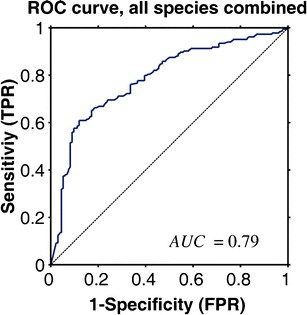

## ROC 
在信号检测理论中，接收者操作特征曲线（receiver operating characteristic curve）是一种坐标图式的分析工具，用于（1）选择最佳的信号侦测模型，舍弃次佳的模型
（2）在同一模型中设定最佳阈值。

ROC分析的是二元分类模型，也就是输出结果只有两种类别的模型，例如：（阳性/阴性）（有病/没病）等。

**术语**

|  |  | 真实值 | 真实值 | 总数 |
| :--- | :--- | :--- | :--- | :--- | 
|  |  | p(positive) | n(negative) |  |
| 预测值 | p' | 真阳性（TP） | 伪阳性（FP） | P' |
| 预测值 | n' | 伪阴性（FN） | 真阴性（TN） | N' |
|  | 总数 | P | N | 

真阳性（TP）:正确的肯定，诊断为有，实际上也有高血压。

伪阳性（FP）:错误的肯定，诊断为有，实际上却没有高血压。第一型错误。

真阴性（TN）:正确的否定，诊断为没有，实际上也没有高血压。

伪阴性（FN）:错误的否定，诊断为没有，实际上却有高血压。第二型错误。

真阳性率（TPR, true positive rate）,又称为 命中率（hit rate），敏感度（sensitivity）

TPR = TP / P = TP / (TP+FN)

伪阳性率（FPR, false positive rate）,又称为 命中率，假警报率 (false alarm rate)

FPR = FP / N = FP / (FP + TN)

真阴性率（TNR）, 又称为 特异度（SPC, specificity）

SPC = TN / N = TN / (FP + TN) = 1 - FPR

准确度 (ACC, accuracy)

ACC = (TP + TN) / (P + N), 即：(真阳性+真阴性) / 总样本数

阳性预测值 (PPV)：PPV = TP / (TP + FP)

阴性预测值 (NPV)：NPV = TN / (TN + FN)

假发现率 (FDR)：FDR = FP / (FP + TP)

**ROC曲线**

x轴：伪阳性率（FPR）; Y轴：真阳性率（TPR）

给定一个二元分类模型和它的阈值，就能从所有样本的（阳性／阴性）真实值和预测值计算出一个 (X=FPR, Y=TPR) 座标点。

例如：假设有100个癌症病人和100个正常人，miR-X的表达值为0，0.1，...10.5的200个值。

我们假设一个阈值：0.5以上为预测有癌症，0.5以下为预测没有癌症的。

||  p | n ||
| :--- | :--- | :--- | :--- |
| p' | TP=63 | FP=28 | 91 |
| n' | FN=37 | TN=72 | 109 |
|| 100 | 100 |

TPR = TP/(TP+FN) = 63/(63+37) = 0.63，FPR = FP/(FP+TN) = 28/(28+72) = 0.28

如果我们调整一个阈值：0.3以上为预测有癌症，0.3以下为预测没有癌症的。

||  p | n ||
| :--- | :--- | :--- | :--- |
| p' | TP=77 | FP=45 | 122 |
| n' | FN=23 | TN=55 | 78 |
|| 100 | 100 |

TPR = TP/(TP+FN) = 77/(77+323) = 0.77，FPR = FP/(FP+TN) = 45/(45+55) = 0.45

完美的预测是一个在左上角的点，在ROC空间座标 (0,1)点，X=0 代表着没有伪阳性，Y=1 代表着没有伪阴性（所有的阳性都是真阳性）。

将同一模型每个阈值 的 (FPR, TPR) 座标都画在ROC空间里，就成为特定模型的ROC曲线。

###########
## Introduction
__ROC(Receiver Operating Characteristic) curve__, 受试者工作特征曲线 in Chinese, is a useful tool for organizing classifiers and visualizaing their performance. It is first developed by electrical engineers and radar engineers in the World War II, which was used to detect enemy object. Since then, it has been widely used in several occasions.

The ROC curve is designed to __evaluate performance of classifier__ based on models. For a given set of sample, we can know that each instance can be mapped to a certain class, whether p or n. In the case of exRNA study, p means this sample is from someone who has cancer and n means this person does not. Classifier based on certain model will map each instance another class, whether Y or N(to distinguish from the real class). In the study of exRNA, Y means that the model shows this person has cancer and N means the opposite. Different models will give different results even considering the same set of sample or data. Thus, it is our interest to determine which model gives the best estimation, and that is the purpose of ROC curve.

What we focus in ROC analysis is how well the model can perform, or how accurate can the model be. In other words, we should consider the proportion of correct guess and wrong guess given by this model. In the above-mentioned part, we already know that there is a real class and a predicted class given by models, thus separating each instance into four groups:

Then we need to calculate several parameters to evaluate the performance of every model. To draw a ROC curve, we need to calculate the true positive rate and the false positive rate of a classifier. The __true positive rate__ is calculated by dividing true positive number by total positive number. The __false positive rate__ is calculated by dividing false positive number by total negative number. In the plot, x axis represents false positive rate, and y axis represents true positive rate. Thus for each model with a given threshold, there is a point in the ROC plot to represent it. If the threshold becomes higher, more instances will be regarded as negative, thus reducing false positive rate but also reducing true positive rate, and vice versa. A better model can have greater y value(true positive rate) and less x value(false positive rate). The following figure displays a typical ROC curve for one model with different threshold.

Besides, there are other perameters that can be used to determine whether a model is good or not. __Sensitivity__ equals true positive rate. __Specificity__ equals true negative numbers dividing by the sum of false positive number and true negative number, or 1 minus false positive rate. These two parameters can also give information about whether this is a good model.

ROC curve is a widely used method in life science. It is generally used in medical decision and recently have been used in machine learning and data mining. In exRNA study, we use ROC curve to demonstrate whether the model formed by machine learning can give a correct diagnosis of cancer or other disease. In data analysis, R language has been used widely, and we can easily use R language to draw ROC curve. The following part demonstrates how to use R language to draw ROC curve using single feature or multiple features.

