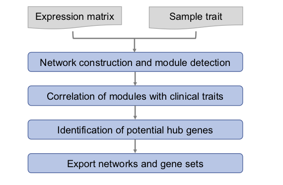
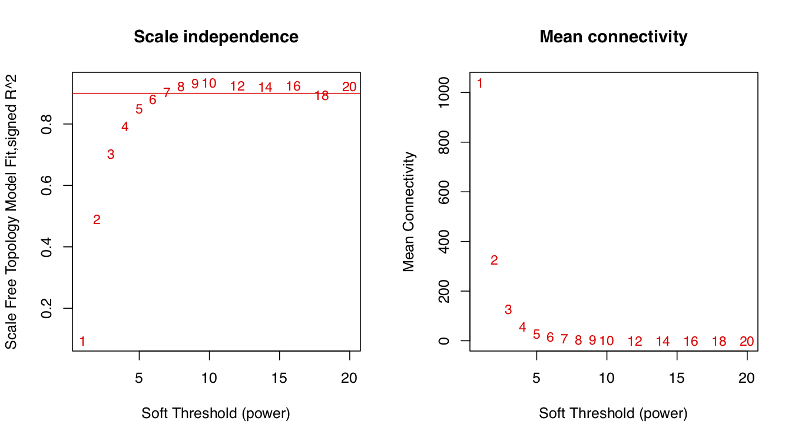
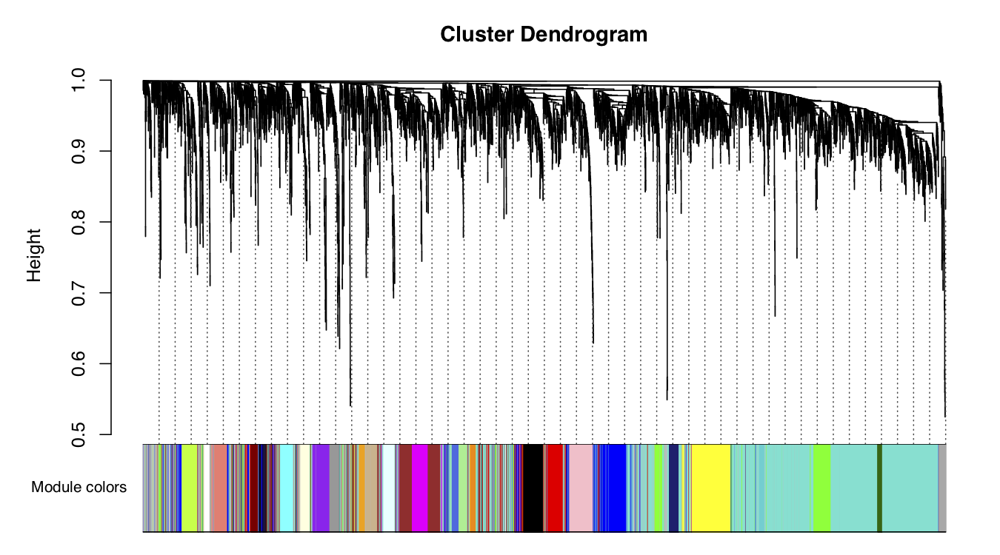
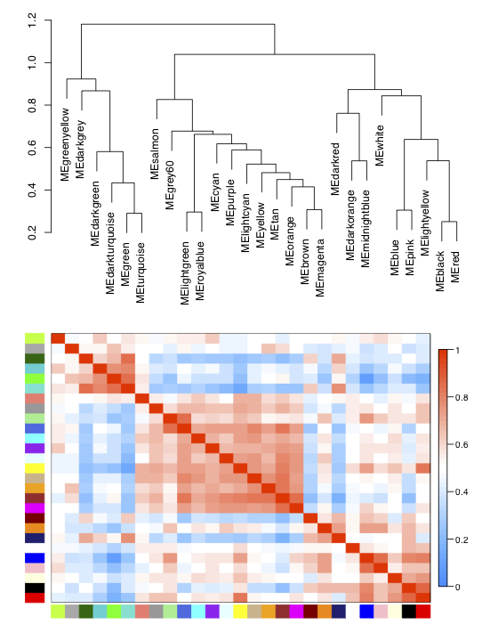
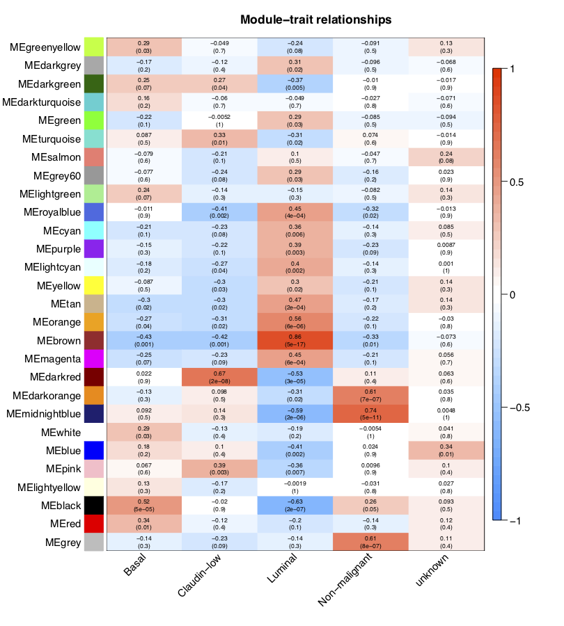
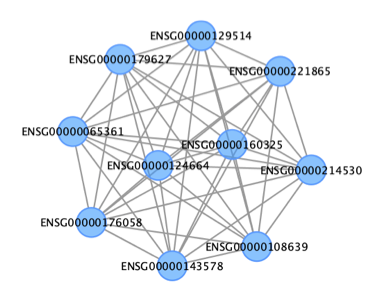
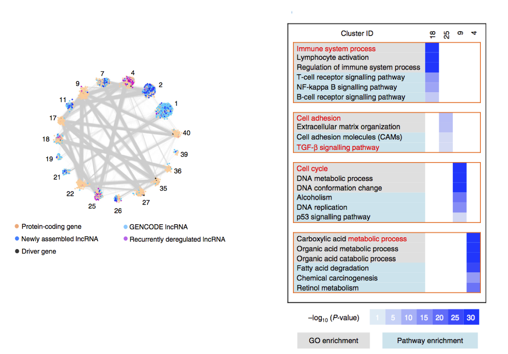

# Co-expression

## Co-expression

## 1.Pipeline



首先计算基因之间的相关系数，构建基因网络\(correlation network of genes\)，然后将具有相似表达模式的基因划分成模块\(module\)。随后计算各个模块与样本表型数据之间的相关性，对特定的感兴趣的模块分析核心基因\(hub gene，通常是转录因子等关键的调控因子\)，并将特定模块的基因提取出来，进行GO/KEGG等分析。

## 2.Data structure

### 2.1.Getting software & data

### 2.2.Input data

输入数据的准备：这里主要是表达矩阵，如果是转录组数据，最好是RPKM值或者其它归一化好的表达量。然后就是临床信息或者其它表型，总之就是样本的属性。

| File name | Description |
| :--- | :--- |
| input\_fpkm\_matrix.rds | GSE48213 breast cancer gene expression matrix \(top 5,000\) |
| data\_traits.rds | 56 cell lines information for the GSM data in GSE48213 |

Import data

```r
setwd("/Share2/home/lulab/xixiaochen/training_share2/co_expression/")
datExpr <- readRDS(file="/Share2/home/lulab/xixiaochen/training_share2/co_expression/input_fpkm_matrix.rds")
datTraits <- readRDS(file="/Share2/home/lulab/xixiaochen/training_share2/co_expression/data_traits.rds")
```

Data character

```r
datExpr[1:4,1:4]
dim(datExpr)
```

```
#           ENSG00000210082 ENSG00000198712 ENSG00000198804 ENSG00000210845
#GSM1172844        78053.20       103151.73       112917.53        92808.32
#GSM1172845        96200.86       157203.85       163847.92        93501.17
#GSM1172846        18259.11        40704.97        13357.02        75183.17
#GSM1172847        33184.15        43673.63        15360.50        91278.61
#GSM1172848        35255.48        55018.26        17715.40        65460.84
#### each row represents a cell line (sample), each column represents the fpkm value of a gene

#[1]   56 5000
#### 56 cell lines (samples), 5000 genes
```

```r
datTraits[1:4,]
dim(datTraits)
```

```
#                  gsm cellline       subtype
#GSM1172844 GSM1172844    184A1 Non-malignant
#GSM1172845 GSM1172845    184B5 Non-malignant
#GSM1172846 GSM1172846    21MT1         Basal
#GSM1172847 GSM1172847    21MT2         Basal
#### each row represents a cell line (sample), each column provides the gsm number, the cell line name and the cell line subtype information

#[1] 56  3
#### 56 cell lines (samples)
#### The rownames of datExpr and datTraits are matched.
```

### 2.3 Output data

| File name | Description |
| :--- | :--- |
| FPKM-TOM-block.1.Rdata | Standarded R file contains the consensus topological overlaps for WGCNA results of the GSE48213 data |
| CytoscapeInput-edges-brown.txt/CytoscapeInput-edges-filter-brown.txt | Input file contains network edge information for Cytoscape |
| CytoscapeInput-nodes-brown.txt/CytoscapeInput-nodes-filter-brown.txt | Input file contains network node information for Cytoscape |
| geneID\_brown.txt | Total gene ID list in specific modules |

## 3.Running steps

### WGCNA分析
#### 基本概念
WGCNA译为加权基因共表达网络分析。该分析方法旨在寻找协同表达的基因模块(module)，并探索基因网络与关注的表型之间的关联关系，以及网络中的核心基因。

适用于复杂的数据模式，推荐5组(或者15个样品)以上的数据。一般可应用的研究方向有：不同器官或组织类型发育调控、同一组织不同发育调控、非生物胁迫不同时间点应答、病原菌侵染后不同时间点应答。

#### 基本原理

从方法上来讲，WGCNA分为**表达量聚类分析和表型关联**两部分，主要包括基因之间相关系数计算、基因模块的确定、共表达网络、模块与性状关联四个步骤。

第一步计算任意两个基因之间的相关系数（Person Coefficient）。为了衡量两个基因是否具有相似表达模式，一般需要设置阈值来筛选，高于阈值的则认为是相似的。但是这样如果将阈值设为0.8，那么很难说明0.8和0.79两个是有显著差别的。因此，**WGCNA分析时采用相关系数加权值，即对基因相关系数取N次幂**，使得网络中的基因之间的连接服从**无尺度网络分布(scale-freenetworks)** ，这种算法更具生物学意义。

**无尺度网络分布**：大部分节点只和很少节点连接，而有极少的节点与非常多的节点连接，生物体选择scale-free network可以保证少数关键基因执行着主要功能，只要保证hub的完整性，整个生命体系的基本活动在一定刺激影响下将不会受到太大影响。

第三步得到模块之后可以做很多下游分析：
（1）模块的功能富集
（2）模块与性状之间的相关性
（3）模块与样本间的相关系数
（4）找到模块的核心基因
（5）利用关系预测基因功能


### 3.0 Install packages

```r
source("https://bioconductor.org/biocLite.R")
biocLite(c("AnnotationDbi", "impute","GO.db", "preprocessCore", "multtest"))
install.packages(c("WGCNA", "stringr", "reshape2"))
```

### 3.1 Library the WGCNA package

```r
library(WGCNA)
```

### 3.2 Pick the soft thresholding power

```r
options(stringsAsFactors = FALSE)
#open multithreading 
enableWGCNAThreads()

powers = c(c(1:10), seq(from=12, to=20, by=2))
#Call the network topology analysis function，choose a soft-threshold to fit a scale-free topology to the network
sft=pickSoftThreshold(datExpr, powerVector = powers, verbose = 5)
```

```
#pickSoftThreshold: will use block size 5000.
# pickSoftThreshold: calculating connectivity for given powers...
#   ..working on genes 1 through 5000 of 5000
#   Power SFT.R.sq  slope truncated.R.sq  mean.k. median.k.  max.k.
#1      1   0.0944 -0.904          0.885 1040.000  1.02e+03 1810.00
#2      2   0.4910 -1.580          0.952  328.000  3.03e+02  866.00
#3      3   0.7030 -1.860          0.983  128.000  1.08e+02  474.00
#4      4   0.7920 -2.000          0.991   57.300  4.38e+01  283.00
#5      5   0.8490 -2.060          0.996   28.400  1.95e+01  179.00
#6      6   0.8810 -2.090          0.991   15.200  9.45e+00  118.00
#7      7   0.9040 -2.070          0.990    8.640  4.89e+00   80.60
#8      8   0.9220 -2.040          0.994    5.170  2.67e+00   56.40
#9      9   0.9330 -2.030          0.995    3.240  1.54e+00   40.50
#10    10   0.9350 -2.020          0.989    2.100  9.29e-01   30.00
#11    12   0.9250 -2.030          0.977    0.971  3.63e-01   17.30
#12    14   0.9210 -2.020          0.982    0.496  1.56e-01   10.50
#13    16   0.9250 -1.970          0.992    0.275  7.04e-02    6.61
#14    18   0.8940 -1.960          0.973    0.163  3.31e-02    4.31
#15    20   0.9220 -1.820          0.986    0.102  1.63e-02    2.89
```

```r
pdf(file="/Share2/home/lulab/xixiaochen/training_share2/co_expression/soft_thresholding.pdf",width=9, height=5)
#Plot the results:
par(mfrow = c(1,2))
cex1 = 0.9
# Scale-free topology fit index as a function of the soft-thresholding power
plot(sft$fitIndices[,1], -sign(sft$fitIndices[,3])*sft$fitIndices[,2],
     xlab="Soft Threshold (power)",ylab="Scale Free Topology Model Fit,signed R^2",type="n",
     main = paste("Scale independence"));
text(sft$fitIndices[,1], -sign(sft$fitIndices[,3])*sft$fitIndices[,2],
     labels=powers,cex=cex1,col="red");
#Red line corresponds to using an R^2 cut-off
abline(h=0.90,col="red")
#Mean connectivity as a function of the soft-thresholding power
plot(sft$fitIndices[,1], sft$fitIndices[,5],
     xlab="Soft Threshold (power)",ylab="Mean Connectivity", type="n",
     main = paste("Mean connectivity"))
text(sft$fitIndices[,1], sft$fitIndices[,5], labels=powers, cex=cex1,col="red")
dev.off()
```



软阈值（即权重参数，可以理解为相关系数的β次幂）取值默认为1到30，上述图形的横轴均代表软阈值，左图的纵轴数值越大，说明该网络越逼近无尺度网络，右图的纵轴表示对应的基因模块中所有基因邻接性的均值。

```r
sft$powerEstimate
#[1] 6
#best_beta = sft$powerEstimate
```

### 3.3 One-step network construction and module detection

把输入的表达矩阵的**几千个基因归类成了几十个模块。**大体思路：计算基因间的邻接性，根据邻接性计算基因间的相似性，然后推出基因间的相异性系数，并据此得到基因间的系统聚类树。


```r
net = blockwiseModules(datExpr,
                 power = sft$powerEstimate,
                 maxBlockSize = 6000,
                 TOMType = "unsigned", minModuleSize = 30,
                 reassignThreshold = 0, mergeCutHeight = 0.25,
                 numericLabels = TRUE, pamRespectsDendro = FALSE,
                 saveTOMs = TRUE,
                 saveTOMFileBase = "FPKM-TOM",
                 verbose = 3)
```

```r
table(net$colors)
#   0    1    2    3    4    5    6    7    8    9   10   11   12   13   14   15 
# 246 1671  355  305  279  270  241  175  168  124  108  101   88   87   84   84 
#  16   17   18   19   20   21   22   23   24   25   26   27 
#  77   67   62   61   60   47   44   41   40   40   38   37
#### table(net$colors) show the total modules and genes in each modules. The '0' means genes do not belong to any module.
```

### 3.4 Module visualization

这里用不同的颜色来代表那些所有的模块，其中灰色默认是无法归类于任何模块的那些基因，如果灰色模块里面的基因太多，那么前期对表达矩阵挑选基因的步骤可能就不太合适。

```r
#Convert labels to colors for plotting
mergedColors = labels2colors(net$colors)
table(mergedColors)
#        black          blue         brown          cyan     darkgreen 
#          175           355           305            84            44 
#     darkgrey    darkorange       darkred darkturquoise         green 
#           40            38            47            41           270 
#  greenyellow          grey        grey60     lightcyan    lightgreen 
#          101           246            67            77            62 
#  lightyellow       magenta  midnightblue        orange          pink 
#           61           124            84            40           168 
#       purple           red     royalblue        salmon           tan 
#          108           241            60            87            88 
#   turquoise         white        yellow 
#         1671            37           279 

#Plot the dendrogram and the module colors underneath
pdf(file="/Share2/home/lulab/xixiaochen/training_share2/co_expression/module_visualization.pdf",width=9, height=5)
plotDendroAndColors(net$dendrograms[[1]], mergedColors[net$blockGenes[[1]]],
                    "Module colors",
                    dendroLabels = FALSE, hang = 0.03,
                    addGuide = TRUE, guideHang = 0.05)
## assign all of the gene to their corresponding module 
## hclust for the genes.
dev.off()
```



### 3.5 Quantify module similarity by eigengene correlation

```r
#Quantify module similarity by eigengene correlation
#Eigengene: One of a set of right singular vectors of a gene's x samples matrix that tabulates, e.g., the mRNA or gene expression of the genes across the samples.

#Recalculate module eigengenes
moduleColors = labels2colors(net$colors)
MEs = moduleEigengenes(datExpr, moduleColors)$eigengenes
#Add the weight to existing module eigengenes
MET = orderMEs(MEs)
#Plot the relationships between the eigengenes and the trait
pdf(file="/Share2/home/lulab/xixiaochen/Share/xixiaochen/project/training/eigengenes_trait_relationship.pdf",width=7, height=9)
par(cex = 0.9)
plotEigengeneNetworks(MET,"", marDendro=c(0,4,1,2), 
                      marHeatmap=c(3,4,1,2), cex.lab=0.8, xLabelsAngle=90)
dev.off()
```



The top part of this plot represents the eigengene dendrogram and the lower part of this plot represents the eigengene adjacency heatmap.

### 3.6 Find the relationships between modules and traits

模块与性状之间的关系

```r
#Plot the relationships between modules and traits
design = model.matrix(~0+ datTraits$subtype)
colnames(design) = levels(datTraits$subtype)
moduleColors = labels2colors(net$colors)
nGenes = ncol(datExpr)
nSamples = nrow(datExpr)
# Recalculate MEs with color labels
MEs0 = moduleEigengenes(datExpr, moduleColors)$eigengenes
MEs = orderMEs(MEs0)
moduleTraitCor = cor(MEs, design, use = "p")
moduleTraitPvalue = corPvalueStudent(moduleTraitCor, nSamples)

pdf(file="/Share2/home/lulab/xixiaochen/Share/xixiaochen/project/training/module_trait_relationship.pdf",width=9, height=10)
#Display the correlations and their p-values
textMatrix = paste(signif(moduleTraitCor, 2), "\n(",
                   signif(moduleTraitPvalue, 1), ")", sep = "")
dim(textMatrix) = dim(moduleTraitCor)
par(mar = c(6, 8.5, 3, 3))
#Display the correlation values within a heatmap plot
labeledHeatmap(Matrix = moduleTraitCor,
               xLabels = colnames(design),
               yLabels = names(MEs),
               ySymbols = names(MEs),
               colorLabels = FALSE,
               colors = blueWhiteRed(50),
               textMatrix = textMatrix,
               setStdMargins = FALSE,
               cex.text = 0.6,
               zlim = c(-1,1),
               main = paste("Module-trait relationships"))
dev.off()
```

通过模块与各种表型的相关系数，可以很清楚的挑选自己感兴趣的模块进行下游分析了。这个图就是把moduleTraitCor这个矩阵给用热图可视化一下。




从上图已经可以看到跟乳腺癌分类相关的基因模块了，包括"Basal" "Claudin-low" "Luminal" "Non-malignant" "unknown" 这5类所对应的不同模块的基因列表。可以看到每一种乳腺癌都有跟它强烈相关的模块，可以作为它的表达signature，模块里面的基因可以拿去做下游分析。我们看到Luminal表型跟棕色的模块相关性高达0.86，而且极其显著的相关，所以值得我们挖掘，这个模块里面的基因是什么，为什么如此的相关呢？


### 3.7 Select specific module

We choose the "brown" module in trait “Luminal” for further analyses.

#### 3.7.1 Intramodular connectivity, module membership, and screening for intramodular hub genes

```r
#Intramodular connectivity, module membership, and screening for intramodular hub genes
#Intramodular connectivity
connet=abs(cor(datExpr,use="p"))^6
Alldegrees1=intramodularConnectivity(connet, moduleColors)

#Relationship between gene significance and intramodular connectivity
which.module="brown"
Luminal= as.data.frame(design[,3])
names(Luminal) = "Luminal"
GS1 = as.numeric(cor(datExpr, Luminal, use = "p"))
GeneSignificance=abs(GS1)

#Generalizing intramodular connectivity for all genes on the array
datKME=signedKME(datExpr, MEs, outputColumnName="MM.")
#Display the first few rows of the data frame

#Finding genes with high gene significance and high intramodular connectivity in specific modules
#abs(GS1)>.8 #adjust parameter based on actual situations
#abs(datKME$MM.black)>.8 #at least larger than 0.8
FilterGenes= abs(GS1)>0.8 & abs(datKME$MM.brown)>0.8
table(FilterGenes)
#FilterGenes
#FALSE  TRUE 
#4997     3
#find 3 hub genes
hubgenes <- rownames(datKME)[FilterGenes]
hubgenes
#[1] "ENSG00000124664" "ENSG00000129514" "ENSG00000143578"
```

#### 3.7.2 Export the network

```r
#Export the network
#Recalculate topological overlap
TOM = TOMsimilarityFromExpr(datExpr, power = 6) 
# Select module
module = "brown"
# Select module probes
probes = colnames(datExpr)
inModule = (moduleColors==module)
modProbes = probes[inModule] 
# Select the corresponding Topological Overlap
modTOM = TOM[inModule, inModule]
dimnames(modTOM) = list(modProbes, modProbes)

#Export the network into edge and node list files Cytoscape can read
#default threshold = 0.5, we could adjust parameter based on actual situations or in Cytoscape
cyt = exportNetworkToCytoscape(modTOM,
    edgeFile = paste("CytoscapeInput-edges-", paste(module, collapse="-"), ".txt", sep=""),
    nodeFile = paste("CytoscapeInput-nodes-", paste(module, collapse="-"), ".txt", sep=""),
    weighted = TRUE,
    threshold = 0.02,
    nodeNames = modProbes, 
    nodeAttr = moduleColors[inModule])

#Screen the top genes
nTop = 10
IMConn = softConnectivity(datExpr[, modProbes])
top = (rank(-IMConn) <= nTop)
filter <- modTOM[top, top]

cyt = exportNetworkToCytoscape(filter,
    edgeFile = paste("CytoscapeInput-edges-filter-", paste(module, collapse="-"), ".txt", sep=""),
    nodeFile = paste("CytoscapeInput-nodes-filter-", paste(module, collapse="-"), ".txt", sep=""),
    weighted = TRUE,
    threshold = 0.02,
    nodeNames = rownames(filter), 
    nodeAttr = moduleColors[inModule][1:nTop])
```

#### 

This plot is visualized by Cytoscape.

The output files look like:

```bash
#Bash Shell command:
head CytoscapeInput-edges-filter-brown.txt
#fromNode    toNode    weight    direction    fromAltName    toAltName
#ENSG00000108639    ENSG00000124664    0.0597956525080059    undirected    NA    NA
#ENSG00000108639    ENSG00000214530    0.0618251730361535    undirected    NA    NA
#ENSG00000108639    ENSG00000129514    0.0339542369643292    undirected    NA    NA
#ENSG00000108639    ENSG00000065361    0.0360849044869507    undirected    NA    NA

##Bash Shell command:
head CytoscapeInput-nodes-filter-brown.txt
#nodeName    altName    nodeAttr.nodesPresent...
#ENSG00000108639    NA    brown
#ENSG00000124664    NA    brown
#ENSG00000214530    NA    brown
#ENSG00000129514    NA    brown
```

#### 3.7.3 Extract gene IDs in specific module

```r
#Extract gene IDs in specific module
#Select module
module = "brown"
#Select module probes (gene ID)
probes = colnames(datExpr)
inModule = (moduleColors == module)
modProbes = probes[inModule]
write.table(modProbes,file="/Share2/home/lulab/xixiaochen/Share/xixiaochen/project/training/geneID_brown.txt",sep="\t",quote=F,row.names=F,col.names=F)
```

The output file looks like:

```bash
head geneID_brown.txt
#ENSG00000170421
#ENSG00000111057
#ENSG00000092841
#ENSG00000169710
#ENSG00000189334
```

We could use the gene ID list for GO/KEGG analysis.

## 4 Appendix：functional annotation of lncRNA
### 4.1 GO/KEGG analysis of the module which interested lncRNAs are involved in.
在WGCNA得到模块之后，通过fisher exact test分析感兴趣的lncRNA(例如：上调或者下调)是否在这些模块中显著富集，挑选出显著富集的模块中的protein coding genes做功能分析。



### 4.2 Construct the lncRNA-mRNA co-expression network, functional analysis of mRNAs which are co-expressed with these interested lncRNAs.

Library packages and load the input data

```r
library(multtest)
lnc_mRNA_dataExpr2 <- readRDS(file="/Share2/home/lulab/xixiaochen/Share/xixiaochen/project/training/lnc_mRNA_dataExpr2.rds")
```

The input file looks like:

```r
dim(lnc_mRNA_dataExpr2)
#[1]     6 2000
#The input data contains 6 samples, 2000 genes (1500 protein coding genes, 500 lncRNAs). 
lnc_mRNA_dataExpr2[1:4,1:4]
#         ENSMUSG00000000031.16 ENSMUSG00000006462.6 ENSMUSG00000006638.14 ENSMUSG00000010492.10
#Ctrl1Hip             0.0000000             0.249761              0.186874               0.120363
#Ctrl2Hip             0.0510846             0.157029              0.221414               0.272098
#Ctrl3Hip             0.0504136             0.168071              0.373061               0.134684
#RF1Hip               0.0000000             0.166485              0.250347               0.492554
####Each row represents a sample, each column represents a gene
```

Calculate the pearson correlation between every two genes.

```r
#Calculate the pearson correlation
Pcc = cor(lnc_mRNA_dataExpr2, method = "pearson")

#Calculate the p-values of the pearson correlation
Pcc_pvalue = corPvalueFisher(Pcc, 6, twoSided = TRUE)

dim(Pcc)
#[1] 2000 2000
Pcc[1:4,1:4]
#                      ENSMUSG00000000031.16 ENSMUSG00000006462.6 ENSMUSG00000006638.14 ENSMUSG00000010492.10
#ENSMUSG00000000031.16            1.00000000            0.1619654            0.09256716            -0.4244842
#ENSMUSG00000006462.6             0.16196545            1.0000000           -0.50330176            -0.5484968
#ENSMUSG00000006638.14            0.09256716           -0.5033018            1.00000000            -0.2397083
#ENSMUSG00000010492.10           -0.42448423           -0.5484968           -0.23970829             1.0000000

dim(Pcc_pvalue)
#[1] 2000 2000
Pcc_pvalue[1:4,1:4]
#                      ENSMUSG00000000031.16 ENSMUSG00000006462.6 ENSMUSG00000006638.14 ENSMUSG00000010492.10
#ENSMUSG00000000031.16             0.0000000            0.7771578             0.8722577             0.4325254
#ENSMUSG00000006462.6              0.7771578            0.0000000             0.3375244             0.2858186
#ENSMUSG00000006638.14             0.8722577            0.3375244             0.0000000             0.6719851
#ENSMUSG00000010492.10             0.4325254            0.2858186             0.6719851             0.0000000
```

```r
write.table(Pcc, file ="/Share2/home/lulab/xixiaochen/training_share2/co_expression/pcc.txt", quote = F, row.names = F, sep="\t")
write.table(Pcc_pvalue, file ="/Share2/home/lulab/xixiaochen/training_share2/co_expression/pcc_pvalue.txt", quote = F,row.names = F, sep="\t")

#Get the row and column names
pcc_pvalue_colnames=colnames(Pcc_pvalue)
pcc_pvalue_rownames=rownames(Pcc_pvalue)

write.table(pcc_pvalue_colnames, file ="/Share2/home/lulab/xixiaochen/training_share2/co_expression/Pcc_pvalue_colnames.txt", quote = F, row.names = F, sep="\t")
write.table(pcc_pvalue_rownames, file ="/Share2/home/lulab/xixiaochen/training_share2/co_expression/Pcc_pvalue_rownames.txt", quote = F, row.names = F, sep="\t")
```

```bash
#Bash Shell command:
#Extract the "protein coding gene & lncRNA" gene-gene pairs
sed -n '502,2001p' pcc_pvalue.txt | cut -f 1-500 > lnc_coding_pvalue.txt
sed -n '502,2001p' pcc.txt | cut -f 1-500 > lnc_coding_pcc.txt
```

```r
#use the multtest package
raw_pvalue = read.table("/Share2/home/lulab/xixiaochen/training_share2/co_expression/lnc_coding_pvalue.txt", sep='\t', quote="", comment="")
#The input file looks like
dim(raw_pvalue)
#[1] 1500  500
raw_pvalue[1:4,1:4]
#           V1        V2        V3        V4
#1 0.4096710 0.396465705 0.2057436 0.80999264
#2 0.6188956 0.004920709 0.6733839 0.20778508
#3 0.5070725 0.931732205 0.7584698 0.66705000
#4 0.9983747 0.465891803 0.3436047 0.03568696
#2000 genes = 1500 protein coding genes, 500 lncRNAs
#Each row represents a protein-coding gene, each column represents a lncRNA.
#The row names are in the "Pcc_pvalue_rownames.txt" file, the column names are in the "Pcc_pvalue_colnames.txt".
```

```r
#Calculate the adjusted p-values
setwd("/Share2/home/lulab/xixiaochen/training_share2/co_expression/adjp/")
#the multtest package: output=adjusted p-values from small to large order, index=original row and column information
for (i in seq(1,dim(raw_pvalue)[2])){
  ad=mt.rawp2adjp(raw_pvalue[,i], proc=c("Bonferroni"))
  adjp=ad$adjp[,2]
  order_index=ad$index
  re=matrix=cbind(adjp,order_index)
  out_file=paste(as.character(i),'txt',sep='.')
  write.table(re, file =out_file, quote = F, row.names = F,sep="\t")
}
```

In the previous step, we will get 500 files. In this step, process these file to get gene pairs with an adjusted P-value of 0.01 or less and with a Pcc value ranked in the top or bottom 0.05 percentile.

```bash
#Bash Shell command:
python get_gene_pairs.py
perl get_gene_pairs.pl adjp_cut.txt pcc_cut.txt gene_pairs.txt
```

the get\_gene\_pairs.py contains:

```python
import pandas as pd
import numpy as np
import os
fold_path='/Share2/home/lulab/xixiaochen/training_share2/co_expression/adjp/'
file_li=os.listdir(fold_path)
adjp_fi_li=[]
for i in range(len(file_li)):
    adjp_pre_li=[]
    file_name=str(i+1)+'.txt'
    file_path=fold_path+file_name
    #print file_path
    data=pd.read_csv(file_path,sep='\t')
    data=data.set_index('order_index').sort_index()
    adjp=data['adjp']
    adjp_pre_li=list(adjp)
    adjp_fi_li.append(adjp_pre_li)
fi_adjp=pd.DataFrame(adjp_fi_li)
adjp_T=fi_adjp.T
comp_adjp=adjp_T[adjp_T<0.01]
#add gene names, each row represents a protein-coding gene, each column represents a lncRNA
col_file='/Share2/home/lulab/xixiaochen/training_share2/co_expression/Pcc_pvalue_colnames.txt'
row_file='/Share2/home/lulab/xixiaochen/training_share2/co_expression/Pcc_pvalue_rownames.txt'
col=pd.read_csv(col_file)
colnames=list(col['x'])[:500]
row=pd.read_csv(row_file)
rownames=list(row['x'])[500:]
def com_get_pair(df):
    df.columns=colnames
    df.index=rownames
    a=[]
    for i in range(df.index.size):
        for j in range(df.columns.size):
            b=[]
            if not np.isnan(df.iloc[i][j]):
                #add the row names
                b.append(df.iloc[i].name)
                #add the column names
                b.append(df.iloc[:,j].name)
                #add value
                b.append(df.iloc[i][j])
                a.append(b)
    df_df=pd.DataFrame(a)
    df_df.columns=['coding genes','lncRNA','Pcc']
    return df_df
#filter Pcc in top 5%
pcc_file='/Share2/home/lulab/xixiaochen/training_share2/co_expression/lnc_coding_pcc.txt'
pcc=pd.read_csv(pcc_file,sep='\t',header=None)
#filter Pcc in bottom 5%
pcc=abs(pcc)
all_pcc=[]
for i in range(pcc.columns.size):
    all_pcc.extend(list(pcc.iloc[:,i]))
all_pcc_se=pd.Series(all_pcc)
cut_pcc=all_pcc_se.quantile(0.95)
pcc_cut=pcc[pcc>cut_pcc]
pcc_df=com_get_pair(pcc_cut)
adjp_df=com_get_pair(comp_adjp)
pcc_out_file='/Share2/home/lulab/xixiaochen/training_share2/co_expression/pcc_cut.txt'
pcc_df.to_csv(pcc_out_file,sep='\t',index=False)
adjp_out_file='/Share2/home/lulab/xixiaochen/training_share2/co_expression/adjp_cut.txt'
adjp_df.to_csv(adjp_out_file,sep='\t',index=False)
```

the get\_gene\_pairs.pl contains:

```perl
#! /usr/bin/perl
open I1, "<$ARGV[0]";
open I2, "<$ARGV[1]";
open OUT, ">$ARGV[2]";
my %list;
while(<I1>){
    chomp;
    @data0 = split/\t/,$_;
    if(/^coding(.*)/){}
    else{
        $list{$data0[0].$data0[1]} = $data0[2];
    }
}
while(<I2>){
    chomp;
    @data = split/\t/,$_;
    if(/^coding(.*)/){
        print OUT "mRNA\tlncRNA\tpcc\tadjp\n";
    }
    if(exists $list{$data[0].$data[1]}){
        $adjp = $list{$data[0].$data[1]};
        print OUT "$_\t$adjp\n";
    }
}        
close I1;
close I2;
close OUT;
```

In the "python get\_gene\_pairs.py" step, the input files include:

| File name | Description |
| :--- | :--- |
| All files in the "~/adjp/" directory | The 5,196 files are the results for adjusted p-values |
| Pcc\_pvalue\_colnames.txt | Column names for the adjusted p-value matrix |
| Pcc\_pvalue\_rownames.txt | Row names for the adjusted p-value matrix |
| lnc\_coding\_pcc.txt | Pcc value matrix, each row represent a protein-coding gene, each column represent a lncRNA |

Please make sure all the input files and the python script are in the same work directory.

The output files looks like:

```bash
#Bash Shell command:
head pcc_cut.txt
#coding genes            lncRNA                    Pcc
#ENSMUSG00000085431.7	ENSMUSG00000033015.16	1.0
#ENSMUSG00000085431.7	ENSMUSG00000037910.2	1.0
#ENSMUSG00000085431.7	ENSMUSG00000038152.4	0.898454912289789
#ENSMUSG00000085431.7	ENSMUSG00000039545.15	0.940380543474745
#ENSMUSG00000085431.7	ENSMUSG00000040657.3	1.0
#ENSMUSG00000085431.7	ENSMUSG00000041674.16	0.8245987116435991
#Each row show a protein-coding gene & lncRNA gene-gene pair, and their Pcc value.

head adjp_cut.txt
#coding genes            lncRNA                   Pcc
#ENSMUSG00000085431.7	ENSMUSG00000033015.16	0.0
#ENSMUSG00000085431.7	ENSMUSG00000037910.2	0.0
#ENSMUSG00000085431.7	ENSMUSG00000040657.3	0.0
#ENSMUSG00000085431.7	ENSMUSG00000055159.7	0.0
#ENSMUSG00000085431.7	ENSMUSG00000073144.4	0.0
#ENSMUSG00000085431.7	ENSMUSG00000073652.10	0.0048784147212109
#Each row show a protein-coding gene & lncRNA gene-gene pair, and their adjusted p-value.
```

In the "perl get\_gene\_pairs.pl adjp\_cut.txt pcc\_cut.txt gene\_pairs.txt" step, the input files include:

Please make sure all the input files and the perl script are in the same work directory.

| File name | Description |
| :--- | :--- |
| pcc\_cut.txt | Pcc values of the "protein-coding gene & lncRNA" gene-gene pairs |
| adjp\_cut.txt | Adjusted p-value of the "protein-coding gene & lncRNA" gene-gene pairs |

the output file looks like:

```bash
head gene_pairs.txt 
#mRNA                     lncRNA                  pcc               adjp
#ENSMUSG00000085431.7	ENSMUSG00000033015.16	1.0	0.0
#ENSMUSG00000085431.7	ENSMUSG00000037910.2	1.0	0.0
#ENSMUSG00000085431.7	ENSMUSG00000040657.3	1.0	0.0
#ENSMUSG00000085431.7	ENSMUSG00000055159.7	1.0	0.0
#ENSMUSG00000085431.7	ENSMUSG00000073144.4	1.0	0.0
#ENSMUSG00000085431.7	ENSMUSG00000073652.10	0.9907736676388159	0.0048784147212109
#Each row show a protein-coding gene & lncRNA gene-gene pair, and their Pcc value, adjusted p-value.
```

We could extract the mRNA gene set for GO/KEGG analysis.

### 5 Homework
Inputdata:
```bash
/Share2/home/lulab/xixiaochen/training_share2/co_expression/homework_FemaleLiver-01-dataInput.RData
134 samples, 3600 genes; each row represents a sample, each column represents a gene.
```
Please try to construct an automatic network and detect module (Choosing the soft-thresholding power, One-step network construction and module detection). Please plot two figures: 1.Analysis of network topology(Scale independence, Mean connectivity) for various soft-thresholding powers, 2.The dendrogram and the module colors underneath.

## 6.Reference

[https://github.com/jmzeng1314/my\_WGCNA](https://github.com/jmzeng1314/my_WGCNA)

[https://horvath.genetics.ucla.edu/html/CoexpressionNetwork/Rpackages/WGCNA/Tutorials/index.html](https://horvath.genetics.ucla.edu/html/CoexpressionNetwork/Rpackages/WGCNA/Tutorials/index.html)

[example](https://github.com/YuminTHU/training_class/tree/master/data/co_expression)
