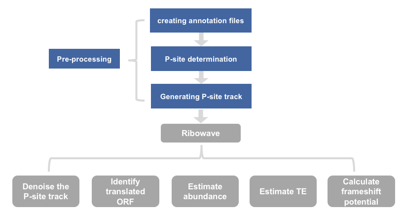
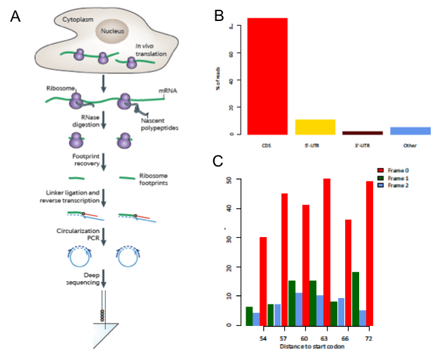
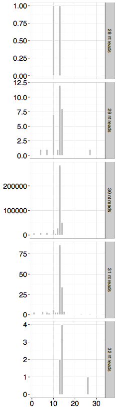

## workflow


## 背景介绍
### Ribo-seq原理
Ribo-seq是2009年Weissman课题组首次发表的研究细胞内蛋白翻译图谱的新型二代测序技术，用来描述全基因组水平蛋白质的翻译情况。主要是**选择性捕捉80S核糖体及其结合的RNA片段而定位核糖体所位于的RNA的位置**。

具体步骤为：
* 在细胞裂解物中富集多聚核糖体（polysome）；
* 将多聚核糖体用核酸酶（RNA nuclease）消化成单核糖体（monosome）
* 选择性的收集和富集80S核糖体并经纯化得到80S核糖体所保护的RNA片段。
* 在此过程中，将80S核糖体保护的RNA片段进行下一步构建文库和测序（图1）。
* 最后，通过生物信息学的分析获得细胞当前状态下的翻译图谱 。

Ribo-seq数据测得的RNA片段长短与small RNA-seq相似，大约分布在25~35nt区间。由于Ribo-seq是特异性描述细胞的翻译组，因此其数据的测序片段大多比对到基因组的CDS区域（coding region）。此外，Ribo-seq还有一个明显区别于其他RNA-seq的特点，即Ribo-seq的序列在CDS区域往往呈现3-nt的周期性（图1）。这主要依赖于翻译过程中核糖体通常以3-nt的周期进行移动。



图1

## 数据处理
download scripts from https://github.com/lulab/Ribowave
### Requirements
#### software: 
R, bedtools v2.25.0
#### R packages: 
reshape, ggplot2, rhdf5, methods, wmtsa, parallel

### Pre-processing
[启动ribo-seq所用的docker](https://lulab2.gitbook.io/teaching/part-iii.-ngs-data-analyses/6.rna-regulation-analyses)（按照链接所示加载新的环境）

启动新的docker环境
```
docker load -i ~/Desktop/bioinfo_tsinghua_6.2_apa_6.3_ribo_6.4_structure.tar.gz
docker run —name=rnaregulation -dt -h bioinfo_docker —restart unless-stopped -v ~/Desktop/bioinfo_tsinghua_share:/home/test/share gangxu/bioinfo_tsinghua_6.2_apa_6.3_ribo_6.4_structure:latest
docker exec -it rnaregulation bash
```
进入工作目录
```
cd /home/test/rna_regulation
cd /home/test/rna_regulation/ribo-wave
```

#### 0. create annotation
```
# bedtools2没有添加到环境变量中，需要临时添加
export PATH=$PATH:test@bioinfo_docker:~/software/bedtools2/bin
# 运行annotation脚本（这一步时间会很久，生成文件已经提前跑好放在了annotation_fly目录下，可以跳过直接进行下一步）
script/create_annotation.sh \
-G annotation_fly/dmel-all-r6.18.gtf \
-f annotation_fly/dmel-all-chromosome-r6.18.fasta  \
-o annotation_fly  \
-s script
```

##### input files
1. <annotation.gtf> : the annotation gtf should contain start_codon and stop_codon information,eg: dmel-all-r6.18.gtf
2. <genome.fasta> : genome fasta ,eg: dmel-all-chromosome-r6.18.fasta
3. <annotation_dir> : the directory for all the annotation output
4. <scripts_dir> : the directory of all the scripts in the package

##### output files
annotation directory, including :
1. start_codon.bed : the bed file annotating start codon
2. final.ORFs : all identified ORFs, eg: FBtr0300105_0_31_546 where FBtr0300105 refers to the transcript, 0 refers to the reading frame relative to the start of transcript, 31 refers to the start site, 546 refers to the stop codon.

#### 1. P-site determination
核糖体上具有一系列与蛋白质合成有关的结合位点与催化位点，分别为A位点(aminoacyl-site，A-site)，P位点(peptidyl-site，P-site)和E位点(exit-site，E- site)先后与tRNA发生结合。P位点是肽段翻译延长的主要场所，在该位点上tRNA将携带的氨基酸移交给旁边的肽段从而使得肽段序列发生延长。为了能够更加明显的观察到3-nt的周期性，在处理Ribo-seq数据时我们参考之前已发表的方法，对每一条Ribo-seq比对上的测序片段转换为其对应的P-site位点。

This step determines the P-site position for each Ribo-seq reads length by overlapping with the annotated start codons from previous step
```
# 运行P-site_determination.sh脚本
script/P-site_determination.sh \
-i GSE52799/SRR1039770.sort.bam \
-S annotation_fly/start_codon.bed \
-o GSE52799 \
-n SRR1039770 \
-s script;
```
##### input files
1. <Ribo_bam> : secondary alignment removed to ensure one genomic position per aligned read and sorted
2. annotation :
  <start_codon.bed> : annotated start site start_codon.bed. It is generated in the create_annotation.sh step.
3. <out_dir> : the directory of the output result, eg: GSE52799
4. <study_name> : the name of all the output file, default: test. eg: SRR1039770
5. <scripts_dir>	: the directory of all the scripts in the package

**查看输出**
```
$ cd /home/test/rna_regulation/ribo-wave/GSE52799/P-site
$ ls
SRR1039770.psite1nt.txt  SRR1039770.psite.pdf  SRR1039770.psite.txt
#正常时输出这三个文件
$ cp *pdf /home/test/share/
# 拷贝pdf文件到容器与计算机互通的文件夹，可以用pdf阅读工具打开查看pdf
```

##### output files

P-site directory, including :
1. name.psite1nt.txt : the Ribo-seq reads length and its corresponding P-sites position(= offset + 1). It may look this this :
```
30  13
```
2. name.psite.pdf : the PDF displaying the histogram of aggregated reads
我们收集了所有已被注释的起始密码子并将 这些起始密码子和Ribo-seq 比对上的序列进行重合，分别计算Ribo-seq序列的5’端偏离起始密码子的第一个碱基A的距离(offset)。根据 Ribo-seq测序片段长度的不同，我们进一步将Ribo-seq片段分成多个组分。在每个长度对应的组分里，作出Ribo-seq片段5’端偏离起始密码子A的距离(offset)的直方图。



每一行代表不同长度的 Ribo-seq 测序片段的直方图。该数据中，30nt的reads数目最多，在30nt长度的Ribo-seq片段中，我们可以明显的看到在距离为13nt的位点含有一个峰值(peak)。鉴于大部分核糖体会在翻译起始位点停滞较多的时间，因此对于30nt长的Ribo-seq片段，其P-site位点的定义应该代表直方图中绝大多数的核糖体，因此我们将P-site位点应该定义为峰值最高的第13个碱基(13nt)的位置。

#### 2. Generating P-site track
基于Ribo-seq序列及其确定的P-site位点，将规律推广到所有Ribo-seq的片段中，直接根据Ribo-seq序列的长度推断其对应的P-site位点。根据这种方法，我们可以将每一条转录本上所有的Ribo-seq片段转化为对应的P-site位点的信号点并获得转录组水平的Ribo-seq信号轨迹（signal track）。由于是由P-site位点定义出的信号轨迹，通常也被叫做P-site信号轨迹（P-sites track）。转录本上每一个位点的信号丰度代表了有多少Ribo-seq片段对应的P-site位点落在该位置上。

This step creats the P-site track for transcripts of interests using determined P-sites position from previous step.
look at transcripts from chromosome X :
**查看输出**
```
script/create_track_Ribo.sh \
-i GSE52799/SRR1039770.sort.bam \
-G annotation_fly/X.exons.gtf \
-g annotation_fly/genome \
-P GSE52799/P-site/SRR1039770.psite1nt.txt \
-o GSE52799 \
-n SRR1039770 \
-s script
```
##### input files
1. <Ribo_bam>
2. <exons.gtf> : a gtf file for only the exons from transcripts of interest, eg: X.exons.gtf
3. <chromosome_size> : the file including all the chromosomes and its genome size. Noted: genome can be obtained by using samtools faidx function with the input of fasta file. genome may look like this:
  ```
  2L	23513712
  2R	25286936
  3L	28110227
  3R	32079331 
  ```
4. P-site:
<P-site_position> : the file listing the P-site position for each read length. This file can be found in the output of     previous step, eg: name.psite1nt.txt
5. <out_dir> : the directory of the output result, eg: GSE52799
6. <study_name> : the name of all the output file, default: test. eg: SRR1039770
7. <scripts_dir> : the directory of all the scripts in the package

**查看生成文件**
```#使用less命令查看psite文件
$ cd /home/test/rna_regulation/ribo-wave/GSE52799/bedgraph/SRR1039770
$ ls
final.psite
$ less final.psite
```
    
##### output files
1. bedgraph/name directory, including :
final.psite : P-site track at transcriptome wide. It may look like this :
```
FBtr0070533	0,0,0,0,0,0,0,0,0,0,0,0,6,2,0,0,0,0,0,0,0,0,0,0,0,0,0,0,0,0,3,1,0,0,0,0,1,0,2,1,0,0,0,0,0,0,4,8,0,0,3,0,5,12,0,0,0,0,0,0,0,0,0,0,0,0,0,0,0,0,0,0
FBtr0073886	0,0,0,0,0,0,0,0,0,0,0,0,0,0,0,0,0,0,0,0,0,0,0,0,0,0,0,0,0,0,0,0,0,0,0,0,0,0,0,0,0,0,0,0,0,0,0,0,0,0,0,0,0,0,0,0,0,0,0,0,0,0,0,0,0,0,2,0,25,0,0,0,0,0,0,0,0,0,0,0,0,0
FBtr0070604	0,0,0,0,0,0,0,0,0,0,0,0,59,6,0,1,0,0,2,6,1,0,1,0,0,0,0,0,0,0,0,0,0,0,0,0,0,0,0,0,0,0,0,0,0,0,0,0,0,0,0,0,0,0,0,0,0,0,0,0,0,0,0,0,0,0,0,0,0,0,0,0
FBtr0070603	0,0,0,0,0,0,0,0,0,0,0,0,75,2,7,10,7,2,0,0,0,0,0,0,0,0,0,0,0,0,0,0,0,0,0,0,0,0,0,0,0,0,0,0,0,0,0,0,1,1,0,0,0,0,3,3,1,0,0,0,0,0,0,0,0,0,0,0,0,0,0,0
```

### Main function
#### 3. RiboWave
This step can achieve multiple functions :

1. denoising [denoise]

降噪:在降噪过程运用了小波变换来去除原始信号中非3-nt周期性的信号使得保留的信号均具有翻译的3-nt周期性，即PF P-site信号轨迹。

2. providing predicted p.value for each given ORF to identify its translation status [pvalue,-P]

鉴定ORF的翻译潜能：根据该转录本上经降噪后的P-sites是否富集在该ORF所在的阅读框内，判断ORF的翻译潜能。P<0.05即具有翻译活性。

3. providing reads density (P-site/PF P-site) for each given ORF [density,-D]

reads density = ORF上reads数/ORF长度，反映翻译水平的abundance。

4. providing translation efficiency (TE) estimation for each given ORF [TE,-T]

TE = 翻译水平的abundance/转录水平的abundance，反映翻译效率。

5. providing frameshift potential (CRF score) for each given ORF [CRF,-F]

鉴定潜在核糖体移码现象。

It might take hours to perform the analysis if the input is large. It is recommended to specify the number of CPU cores through the -p option.

Run Ribowave on example:
#### Denoise the P-site track
```
# 在/home/test/rna_regulation/ribo-wave目录下
mkdir -p /home/test/rna_regulation/ribo-wave/GSE52799/Ribowave
script/Ribowave  \
-a GSE52799/bedgraph/SRR1039770/final.psite \
-b annotation_fly/final.ORFs \
-o GSE52799/Ribowave \
-n SRR1039770 \
-s script -p 8
```
#### Identifying translated ORF
```
mkdir -p /home/test/rna_regulation/ribo-wave/GSE52799/Ribowave
script/Ribowave \
-P \
-a GSE52799/bedgraph/SRR1039770/final.psite \
-b annotation_fly/final.ORFs \
-o GSE52799/Ribowave \
-n SRR1039770 \
-s script \
-p 8
```
#### Estimating abundance
```
mkdir -p /home/test/rna_regulation/ribo-wave/GSE52799/Ribowave
script/Ribowave \
-D \
-a GSE52799/bedgraph/SRR1039770/final.psite \
-b annotation_fly/final.ORFs \
-o GSE52799/Ribowave \
-n SRR1039770 \
-s script \
-p 8
```
#### Estimating TE
IMPORTANT : when estimating TE, user should input the sequenced depth of Ribo-seq and the FPKM value from paired RNA-seq
```
mkdir -p /home/test/rna_regulation/ribo-wave/GSE52799/Ribowave
script/Ribowave \
-T 9012445  GSE52799/mRNA/SRR1039761.RPKM \
-a GSE52799/bedgraph/SRR1039770/final.psite \
-b annotation_fly/final.ORFs \
-o GSE52799/Ribowave \
-n SRR1039770 \
-s scripts \
-p 8
```
#### Calculating frameshift potential
on annotated ORFs
```
mkdir -p /home/test/rna_regulation/ribo-wave/GSE52799/Ribowave
awk -F '\t' '$3=="anno"'  annotation_fly/final.ORFs  >   annotation_fly/aORF.ORFs;
script/Ribowave \
-F \
-a GSE52799/bedgraph/SRR1039770/final.psite \
-b annotation_fly/aORF.ORFs \
-o GSE52799/Ribowave \
-n SRR1039770 \
-s script \
-p 8
```
#### Multiple functions
```
mkdir -p /home/test/rna_regulation/ribo-wave/GSE52799/Ribowave
script/Ribowave \
-PD \
-T 9012445  GSE52799/mRNA/SRR1039761.RPKM \
-a GSE52799/bedgraph/SRR1039770/final.psite \
-b annotation_fly/final.ORFs \
-o GSE52799/Ribowave \
-n SRR1039770 \
-s script \
-p 8
```

##### input files
1. bedgraph/name:
<P-site track> : output from the previous step, containing the P-site track of transcripts of interest, eg: final.psite
2. <ORF_list> : ORFs of interest ,eg : final.ORFs. It is generated in the step of create_annotation.sh
3. <Ribo-seq sequenced depth> : the sequenced depth of Ribo-seq to calculate FPKM , eg: 9012445
4. <RNA FPKM> : FPKM table. It may look like this :
  
```
 FBtr0100871	22262
 FBtr0070604	18682
 FBtr0100231	14746.5
 FBtr0100874	14024.5
 FBtr0100864	11475.6
```

##### output files
1. name.PF_psite	: the denoised signal track(PF P-sites signal track) at transcriptome wide. It looks similar as the input final psite.
2. including chi-square P-value information. It may look like this :
```
column1-4: basic information about the ORF
column5: reads coverage within the ORF
column6: P-value predicted by RiboWave
column7: Values estimating the relative abundance of PF P-sites outside of the studied ORF
column8: Reads intensity at the current start codon
```
result directory, including :
3. name.95%.mx : RiboWave makes the prediction on the translation initiation sites and gives the final translated product output (p.value < 0.05) . It may look like this :
```
FBtr0070007_2_93_1028
FBtr0070008_1_128_943
FBtr0070025_2_135_1094
```
4. name.density	: reads density ( PF P-site ) of given ORFs. It may look like this :
```
column1-4: basic information about the ORF
column5: number of PF P-sites in transcript
column6: number of PF P-sites in given ORF
column7: density of PF P-sites in given ORF
```
5. name.TE : TE of given ORFs. It may look like this :
```
column1: transcript
column2: ORF
column3: TE
```
6. name.CRF.final : ORFs that might experience reading frame translocation. It may look like this :
```
column1: ORF
column2: start of frameshift
column3: stop of frameshift
column4: PF P-sites' reading frames after the change point ,eg: 2_2,0_1 where 2_2 refers to continuous two PF P-sites of frame 2 followed by continuous one PF P-sites of frame 0.
column5: Relative position of PF P-sites after the shift ,eg : 1413,1440;1789 where 1413,1440 corresponds to the exact position of 2_2 within the transcript. Discontinuity in the reading frame is separated by ;
column6: CRF score describing the potential of frameshift
```

## 数据库推荐
http://lulab.life.tsinghua.edu.cn/postar/

