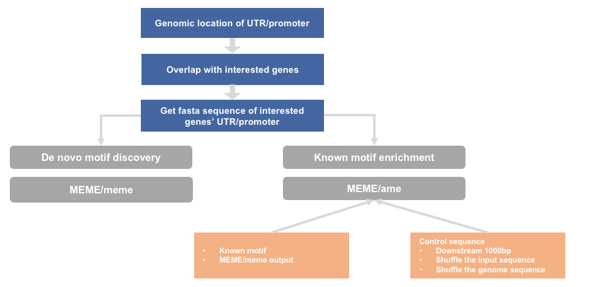
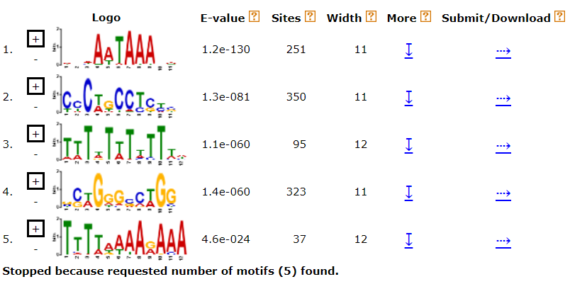
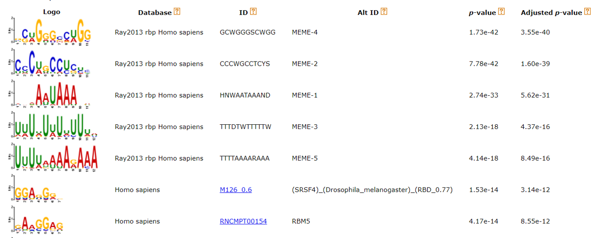

### sequence motif analysis
#### workflow


---
container: bioinfo_tsinghua
fa文件、fa.fai文件、gtf文件、chrom.sizes文件和所需tar.gz文件从这里下载[清华大学云盘](https://cloud.tsinghua.edu.cn/d/8bf3e363bae145c69469/)

---
#### running steps

##### 1. get UTR or promoter sequence
###### 1.1 install R package GenomicFeatures and biozhuoer tools (cnode)
---
需要用root权限进入container bioinfo_tsinghua

GenomicFeatures package used to extract needed sequence/提取所需序列

biozhuoer tools used to concat sequences of the same UTR or promoter/用于连接序列（具有相同UTR或启动子的序列）

---
**将所需文件放在相应位置**
```bash
# 将下载好的gtf文件和tar.gz文件放在share文件夹中
docker exec -it bioinfo_tsinghua bash
cp ~/share/example_motif.tar.gz ./
tar -zxvf example_motif.tar.gz
rm example_motif.tar.gz
mkdir -p ~/motif/sequence_motif/genome
# 将下载好的gtf文件复制到genome目录下
cd ~/motif/sequence_motif/genome
cp ~/share/GRCh38.p10.genome.fa ./
cp ~/share/GRCh38.p10.genome.fa.fai ./
cp ~/share/hg38.chrom.sizes ./
# 退出容器
exit
```
---
**配置所需环境**
To install this package, start R (my R version is “3.5.1”) and enter:
```bash
# 系统终端以root身份进入容器
docker exec -it -u root bioinfo_tsinghua bash
$ R
#进入R，依次执行下面几行语句
source("http://www.bioconductor.org/biocLite.R")
# 下面这个要跑挺久
biocLite("GenomicFeatures")
library("GenomicFeatures")
if (!("devtools" %in% .packages(T))) install.packages("devtools")
devtools::install_github("dongzhuoer/biozhuoer")
# 完成后会显示 *DONE（biozhuoer）
# 退出R
q()
# 退出docker容器
$ exit
# 首次进行Sequence Motif分析的时候需要运行上面命令来安装和更新package，再次使用就不需要了
```

---
###### 1.2对基因组注释文件操作
```bash
mkdir -p /home/test/motif/sequence_motif/practice
cd /home/test/motif/sequence_motif/practice
```

---
#### generate txdb object
There are many functions for us to get genome annotation file/基因组注释文件功能很多:
```r
# 进入R环境
$ R
# 载入package-GenomicFeatures
library("GenomicFeatures")
# 指定路径
gtf_file="../genome/gencode.v27.annotation.gtf"
txdb <- makeTxDbFromGFF(gtf_file, format="gtf")
```
运行结果
```r
Import genomic features from the file as a GRanges object ... OK
Prepare the 'metadata' data frame ... OK
Make the TxDb object ... OK
Warning message:
In .get_cds_IDX(type, phase) :
  The "phase" metadata column contains non-NA values for features of type
  stop_codon. This information was ignored.
>
```

---
###### 1.3 get 3'UTR & 5'UTR site range

```r
# 继续操作
utr5p = fiveUTRsByTranscript(txdb, use.names=T)
utr3p = threeUTRsByTranscript(txdb, use.names=T)

utr3p.df=as.data.frame(utr3p)
utr5p.df=as.data.frame(utr5p)

write.table(utr3p.df, "utr3p.info", row.names=FALSE, sep='\t',quote=FALSE )
write.table(utr5p.df, "utr5p.info", row.names=FALSE, sep='\t' ,quote=FALSE)
# R环境下的操作结束，退出R，Save workspace image？选n即可
q()
# 查看生成的两个文件
$ ls
utr3p.info  utr5p.info
```
这样就获取了5’UTR or 3’UTR的位置信息，如下图


---
get promoter site range
同样的操作获得promoter的位置信息

```r
# 再次进入R环境
$ R
# 载入package-GenomicFeatures
library("GenomicFeatures")
# 指定路径
gtf_file="/home/test/0.genome/human_hg38/anno/gtf/gencode.v27.annotation.gtf"
txdb <- makeTxDbFromGFF(gtf_file, format="gtf")
# （如果上一小节没有退出R环境，就可以不用重新载入包和指定变量，可以再试试）没理解不要紧继续往下
promoter=promoters(txdb)
promoter.df=as.data.frame(promoter)
write.table(promoter.df, "promoter.info", row.names=FALSE, sep='\t' ,quote=FALSE)
q()
```
这样我们就获得了非常有用的三个文件
```bash
> q()
Save workspace image? [y/n/c]: n
test@1a8b4fa42d00:~/motif/sequence_motif/practice$ ls
promoter.info  utr3p.info  utr5p.info
test@1a8b4fa42d00:~/motif/sequence_motif/practice$
```

---
##### 2. intersect with interested genes

回到bash下对刚刚这几个文件进行进一步加工，获取我们想要的信息

---
###### 2.1 interested 3'UTR

```bash
sort -t $'\t' -k 2 utr3p.info|join -o 1.3 2.1 1.2 1.9 1.4 1.5 1.6 1.7 1.8 1.10 -t $'\t' -1 2 -2 2 - \
  <(cut -f 1 ../SC2_SF2.ct.dn.1_0.01.protein_coding |sort |join -t $'\t' -1 1 -2 1 - <(sort -t $'\t' -k 1 \
  <(grep -o -P -e "gene_id.*; transcript_id.*?;" ../genome/gencode.v27.annotation.gtf |sort |uniq|sed -e 's/gene_id "//' -e 's/"; transcript_id "/\t/' -e 's/";//'))|sort -t $'\t' -k 2  ) |\
  sort -t $'\t' -k 1 >interested_three_prime_UTR.info
```

```
# 可以用less查看一下刚刚生成的文件
less interested_three_prime_UTR.info
# 按q退出
q
```
explanation for interested_three_prime_UTR.info:
```bash
column1: chr
column2: gene
column3: transprict
column4: exon_name
column5: start
column6: end
column7: width(seq length)
column8: strand
column9: exon_id
column10: exon_rank
```

###### 2.2 interested promoter
同理再试一次，这次获取感兴趣的promoter信息，尝试思考每个命令的含义
```bash
sort -t $'\t' -k 7 promoter.info|join -o 1.1 2.1 1.7 1.2  1.3 1.4 1.5 1.6 -t $'\t' -1 7 -2 2 - \
  <(cut -f 1 ../SC2_SF2.ct.dn.1_0.01.protein_coding |sort |join -t $'\t' -1 1 -2 1 - \
  <(sort -t $'\t' -k 1 <(grep -o -P -e "gene_id.*; transcript_id.*?;" ../genome/gencode.v27.annotation.gtf |sort \
  |uniq|sed -e 's/gene_id "//' -e 's/"; transcript_id "/\t/' -e 's/";//' ))|sort -t $'\t' -k 2  ) |\
  sort -t $'\t' -k 1 >interested_promoter.info
```

explanation for interested_promoter.info:

```bash
column1: chr
column2: gene
column3: transprict
column4: start
column5: end
column6: width(seq length)
column7: strand
column8: transprict_id
```

---

##### 3. convert to bed format

---
###### 3.1 'UTR bed info

```bash
cat interested_three_prime_UTR.info | \
  awk '{print $1 "\t" $5-1 "\t" $6 "\t" $3 "\t" $2 "\t" $8}' | \
  sort -u  > interested_three_prime_UTR.bed
```

explanation for interested_three_prime_UTR.bed:

```bash
column1: chr
column2: start
column3: end
column4: gene
column5: transcript
column6: strand
```

###### 3.2 promoter bed info

```bash
cat interested_promoter.info | \
  awk '{print $1 "\t" $4-1 "\t" $5 "\t" $3 "\t" $2 "\t" $7}' | \
  sort -u  > interested_promoter.bed
```

explanation for interested_promoter.bed:

```bash
column1: chr
column2: start
column3: end
column4: gene
column5: transcript
column6: strand
```

---
##### 4. get genome sequence

---

**安装bedtools**
**使用docker的root用户进入容器（前面介绍如何使用root身份了）
```bash
apt-get install bedtools
# 退出docker
```
###### 4.1 get 3'UTR related genome sequence
以test身份进入docker容器

```bash
cd motif/sequence_motif/practice/
bedtools getfasta -s -name -fi ../genome/GRCh38.p10.genome.fa \
  -bed interested_three_prime_UTR.bed -fo interested_three_prime_UTR.fa

# less 查看生成的interested_three_prime_UTR.fa,可以看到序列信息
less interested_three_prime_UTR.fa
```

###### 4.2 concatenate sequences of the same 3’ UTR

```r
# R环境下
library(dplyr)

concatenate_seq <- function(fasta_file) {
    biozhuoer::read_fasta(fasta_file) %>% 
        dplyr::mutate(name = stringr::str_extract(name, 'ENST[\\d\\.]+')) %>% 
        dplyr::group_by(name) %>% dplyr::summarise(seq = paste0(seq, collapse = '')) %>% 
        biozhuoer::write_fasta(fasta_file)
}
concatenate_seq('interested_three_prime_UTR.fa')
# less 查看生成的interested_three_prime_UTR.fa,这次处理后，该文件发生了什么变化？
less interested_three_prime_UTR.fa
```

###### 4.3 get promoter related genome sequence

```bash
# 回到bash
bedtools getfasta -s -name -fi ../genome/GRCh38.p10.genome.fa \
  -bed interested_promoter.bed -fo interested_promoter.fa
```

###### 4.4 concatenate sequences of the same promoter

```r
library(dplyr)
concatenate_seq <- function(fasta_file){biozhuoer::read_fasta(fasta_file) %>% dplyr::mutate(name = stringr::str_extract(name, 'ENST[\\d\\.]+')) %>% dplyr::group_by(name) %>% dplyr::summarise(seq = paste0(seq, collapse = '')) %>% biozhuoer::write_fasta(fasta_file)}
concatenate_seq('interested_promoter.fa')
```


##### 5. generate random sequence as background sequence
**MEME安装**
root用户进入容器
```bash
mkdir /home/test/software/MEME
cd /home/test/software/MEME
wget http://meme-suite.org/meme-software/5.1.0/meme-5.1.0.tar.gz
tar zxf meme-5.1.0.tar.gz
mdir meme
cd meme-5.1.0
./configure —-prefix=/home/test/software/MEME/meme —-with-url=http://meme-suite.org/ —-enable-build-libxml2 —-enable-build-libxslt
make test
make install
# 安装完成后加入环境变量
vim /home/test/.bashrc
# 在最后添加两行
export PATH=$PATH:/home/test/software/MEME/meme/bin/
export PATH=$PATH:/home/test/software/MEME/meme/libexec/meme-5.1.0
# 保存
```
there are three mothods to get random sequence: 1. shuffle the input sequence 2. downsteam 1000bp 3. bedtools shuffle

###### 5.1 shuffle the input sequence
需要按照上述方法安装MEME
```bash
/home/test/motif/sequence_motif/practice
fasta-shuffle-letters \
interested_three_prime_UTR.fa \
interested_three_prime_UTR.control

fasta-shuffle-letters \
interested_promoter.fa \
interested_promoter.control
```

###### 5.2 downstream 1000bp as bg

[https://dongzhuoer.github.io/diff\_exp\_2018\_zhuoer/motif.html](https://dongzhuoer.github.io/diff_exp_2018_zhuoer/motif.html)

```r
library(dplyr)

slide <- function(input_bed, output_bed, n = 1000) {
    col_names <- c('chr', 'start', 'end', 'name', 'score', 'strand');

    original <- readr::read_tsv(input_bed, col_names) %>% 
        dplyr::group_by_at(-2:-3) %>% 
        dplyr::summarise(length = sum(end - start), end = max(end)) %>% 
        dplyr::ungroup()

    if (n > 0) {
       slide <- original %>% dplyr::mutate(start = end + n, end = start + length)
    } else {
       slide <- original %>% dplyr::mutate(end = start + n, start = end - length)
    }

    slide %>% dplyr::select(chr, start, end, name, score, strand) %>% 
        readr::write_tsv(output_bed, col_names = F)
}
slide('interested_three_prime_UTR.bed', 'interested_three_prime_UTR_downstream.bed')
slide('interested_promoter.bed', 'interested_promoter_downstream.bed')
```

repeat get promoter and get 3'UTR section

###### 5.3 bedtools shuffle
```bash
bedtools shuffle -i interested_three_prime_UTR.bed \
-g ../genome/hg38.chrom.sizes >interested_three_prime_UTR_btools.bed

bedtools shuffle -i interested_promoter.bed \
-g ../genome/hg38.chrom.sizes >interested_promoter_btools.bed
```

repeat get promoter and get 3'UTR section

---

##### 6. motif enrichment

---
###### 6.1 de novo motif discovery
test用户进入容器
```bash
cd /home/test/motif/sequence_motif/practice/
meme -dna -maxsize 2000000 \
  -minw 4 -maxw 12 \
  -oc promoter_de_novo \
  -nmotifs 5 \
  interested_promoter.fa
# 可以查一查为什么用2000000，用1000000试试？
# 可以将输出文件夹整个cp到share中查看
cp -r promoter_de_novo/ ~/share/
```

output



---
###### 6.2 known motif enrichment

1. download known motif from meme
2. add de novo motif file by meme

   for 3'UTR

```bash
mkdir UTR_output
ame \
--control interested_three_prime_UTR.control \
--oc UTR_output/ \
interested_three_prime_UTR.fa \
../Homo_sapiens.meme \
../Ray2013_rbp_Homo_sapiens.meme
```

   for promoter

```bash
mkdir promoter_output
ame \
--control interested_promoter.control \
--oc promoter_output/ \
interested_promoter.fa \
../JASPAR2018_CORE_vertebrates_non-redundant.meme \
../HOCOMOCOv11_core_HUMAN_mono_meme_format.meme
```

   example output



#### Homework
1. 理解“concatenate sequences of the same 3'UTR”的含义，并找出一个具体的gene的3’UTR当做例子，解释这一步实现的效果。
2. 自己写一个脚本实现“concatenate sequences of the same 3'UTR”这一步，并以上面找到的具体gene的3'UTR当做示例，展示输入文件，输出文件，及运行脚本。
