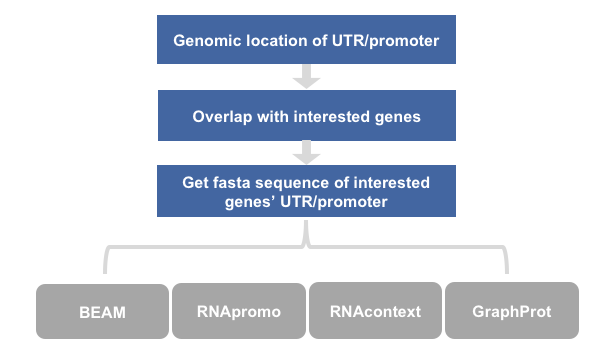
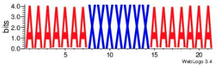
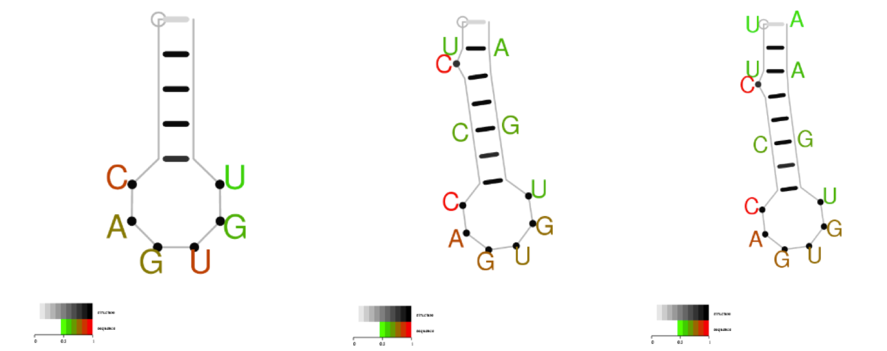

## sequence motif analysis
### workflow


### 1.BEAM
#### 1.1 Use RNAfold to get dot-bracket
Compute the best (MFE) structure for this sequence (primary sequence with dot-bracket)
```
RNAfold <test.fa >dot.fa
```
#### 1.2 Get file with BEAR notation ---> fastB (fastBEAR).
```
awk '/^>/ {print; getline; print; getline; print $1}' dot.fa >dot_to_encode.fa
java -jar /BioII/lulab_b/songyabing/motif_analysis/software/BEAM/beam-2.0/BearEncoder.new.jar dot_to_encode.fa BEAMready.fa
```
#### 1.3 get structure motifs
```
java -jar /BioII/lulab_b/songyabing/motif_analysis/software/BEAM/beam-2.0/BEAM_release1.6.1.jar -f BEAMready.fa -w 10 -W 40 -M 3 
```
#### 1.4 visualize motifs with weblogo
##### 1.4.1 install weblogo
```
pip install weblogo
```
##### 1.4.2 visualize structure motifs
```
weblogo -a 'ZAQXSWCDEVFRBGTNHY' -f BEAMready_m1_run1_wl.fa -D fasta \
-o out.jpeg -F jpeg --composition="none" \
-C red ZAQ 'Stem' -C blue XSW 'Loop' -C forestgreen CDE 'InternalLoop' \
-C orange VFR 'StemBranch' -C DarkOrange B 'Bulge' \
-C lime G 'BulgeBranch' -C purple T 'Branching' \
-C limegreen NHY 'InternalLoopBranch'
```
#### 1.4.3 example output


### 2. RNApromo
#### 2.1 download
https://genie.weizmann.ac.il/pubs/rnamotifs08/64bit_exe_rnamotifs08_motif_finder.tar.gz
#### 2.2 predict structure motifs
```
rnamotifs08_motif_finder.pl -positive_seq input_pos_seq.fa -output_dir Output
```
##### input
Positive sequences - a fasta format file containing the sequences to predict motifs on.
```
>Pos_1
ATAAGAGACCACAAGCGACCCGCAGGGCCAGACGTTCTTCGCCGAGAGTCGTCGGGGTTTCCTGCTTCAACAGTGCTTGGACGGAACCCGGCGCTCGTTCCCCACCCCGGCCGGCCGCCCATAGCCAGCCCTCCGTCACCTCTTCACCGCACCCTCGGACTGCCCCAAGGCCCCCGCCGCCGCTCCA
```
##### example output


#### 2.3 find known motifs
After learning a motif, you can search a database of sequences to find positions that match the motif you learned. To do that you need to first match a secondary structure to each of the input sequences in your database, either using existing structure prediction algorithms, or using some other information.
#### 2.3.1 Produce a likelihood score for each sequence in the database.
```
rnamotifs08_motif_match.pl database.tab -cm model.cm
```
##### input
The database is then specified in the following format: <id> <sequence> <structure>
database.tab
```
seq_1	AUAAGAGACCACAAGCGACCCGCAGGGCCAGACGUUCUUCGCCGAGAGUCGUCGGGGUUUCCUGCUUCAACAGUGCUUGGACGGAACCCGGCGCUCGUUCCCCACCCCGGCCGGCCGCCCAUAGCCAGCCCUCCGUCACCUCUUCACCGCACCCUCGGACUGCCCCAAGGCCCCCGCCGCCGCUCCA	.............((((..(.((.(((((.(((((((((....))))).))))(((((.((((((...(((((((((.((......)).)))))).))).........(((.(((........))).)))..................))).....)))..)))))..)))))..)).).))))...
```
##### output
```
seq_2:0    19.7698
seq_7:0    19.3706
seq_3:0    19.1064
seq_1:0    18.073
seq_5:0    16.5508
seq_9:0    14.5906
seq_4:0    10.3685
seq_10:0   9.15077
seq_6:0    6.81294
seq_8:0    0.233537
```
#### 2.3.2 Produce a likelihood score for the best motif position in each sequence in the database, and the position itself.
##### output
```
seq_2:0    19.7698    33      48      UUCAACAGUGUUUGGA        (((((......)))))        <<<<<,,,,,,>>>>>
seq_7:0    19.3706    104     119     GGGAGCAGUGUCUUCC        (((((......)))))        <<<<<,,,,,,>>>>>
seq_3:0    19.1064    16      31      GUCCUCAGUGCAGGGC        (((((......)))))        <<<<<,,,,,,>>>>>
seq_1:0    18.073     30      52      GACGUUCUUCGCCGAGAGUCGUC (((((((((....))))).)))) <<<<<<<<<,--->>>>>,>>>>
seq_5:0    16.5508    104     119     AGCUACAGUGUUAGCU        (((((......)))))        <<<<<,,,,,,>>>>>
seq_9:0    14.5906    32      47      GAGCCAGUGUGUUUCU        ((((......))))..        <<<-,,,,,,->>>,,
seq_4:0    10.3685    7       21      UUGUCAGUGCACAAA         ((((......)))).         <<<<,,,,,,>>>>,
seq_10:0   9.15077    133     152     CAACCUCCACCUUCUGGGUU    .(((((.........)))))    ,<----,,,,,,,,,---->
seq_6:0    6.81294    1       16      UAUGGAGAUUUCCAUA        (((((......)))))        <<<<<,,,,,,>>>>>
seq_8:0    0.233537   95      115     ACACCCCAGCCCUGCAGUGUA   ((((..((....))..)))).   <<<<,,--,,,,---->>>>,
```

### 0. get interested sequence and control sequence as sequence motif analysis
### 1. GraphProt:modelling binding preferences of RNA-binding proteins
#### 1.1 get optimized parameters

#### 1.2 train a model
#### 1.3 get structure motif with graphprot
