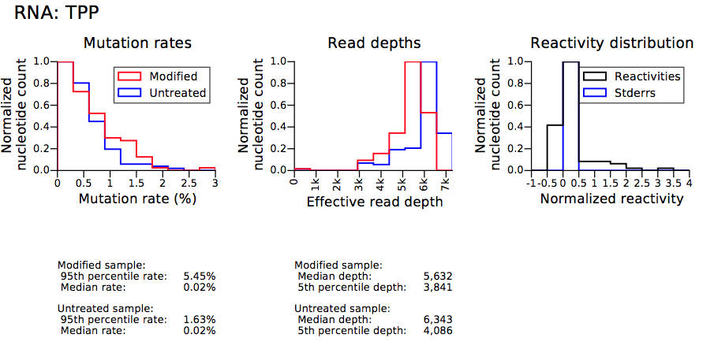
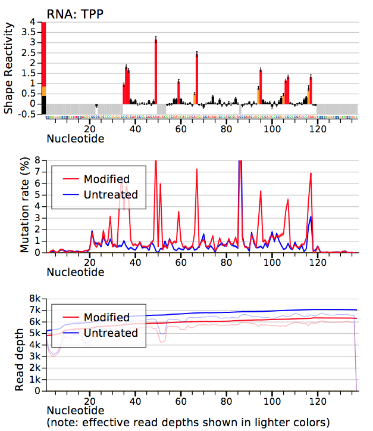

## structure-seq analysis (Shape-map)
### background


RNA is treated with a SHAPE reagent that reacts at conformationally dynamic nucleotides. During reverse transcription, polymerase reads through chemical adducts in the RNA and incorporates a nucleotide noncomplementary to the original sequence (red) into the cDNA. The resulting cDNA is sequenced using any massively parallel approach to create a mutational profile. Sequencing reads are aligned to a reference sequence, and nucleotide-resolution mutation rates are calculated, corrected for background and normalized, producing a standard SHAPE reactivity profile. SHAPE reactivities can then be used to model secondary structures, visualize competing and alternative structures, or quantify any process or function that modulates local nucleotide RNA dynamics.

### 1.shapemapper
ShapeMapper automates the calculation of RNA structure probing reactivities from mutational profiling (MaP) experiments, in which chemical adducts on RNA are detected as internal mutations in cDNA through reverse transcription and read out by massively parallel sequencing. 
```
shapemapper \
--target TPP.fa \
--name "example-results" \
--overwrite \
--modified --folder TPPplus \
--untreated --folder TPPminus \
--star-aligner
--verbose
#--denatured --folder TPPdenat
```
#### input

#### output
1. example-results_TPP_histograms.pdf

2. example-results_TPP_profiles.pdf 

3. example-results_TPP_profile.txt
4. example-results_TPP.map
5. example-results_TPP.shape
