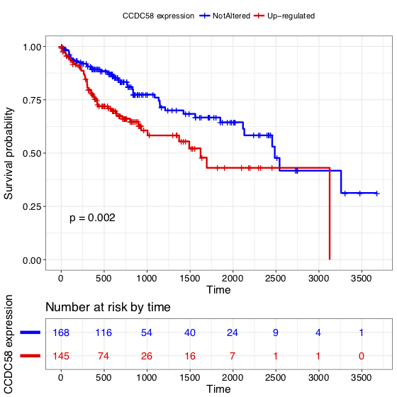

# Survival analysis

## Survival analysis

### 1.Pipeline

**Survival analysis** is a branch of statistics for analyzing the expected duration of time until one or more events happen, such as death in biological organisms and failure in mechanical systems. \([https://en.wikipedia.org/wiki/Survival\_analysis](https://en.wikipedia.org/wiki/Survival_analysis)\)

生存分析是研究生存时间和相关因素有无关系以及样本生存时间的分布规律的一种统计分析方法。

生存分析使用的方法：

1. 描述生存过程：Kaplan-Meier plots to visualize survival curves（根据生存时间分布，估计生存率及其标准误，绘制生存曲线。常用Kaplan-Meier法，还有寿命法）
2. 比较生存过程：Log-rank test to compare the survival curves of two or more groups（通过比较两组或者多组之间的的生存曲线，一般是生存率及其标准误，从而研究之间的差异，一般用log rank检验\)
3. 影响生存时间的因素分析：Cox proportional hazards regression to describe the effect of variables on survival（用Cox风险比例模型来分析变量对生存的影响，可以两个及两个以上的因素）

Reference: [http://www.sthda.com/english/wiki/cox-proportional-hazards-model](http://www.sthda.com/english/wiki/cox-proportional-hazards-model)

### 2.Data structure

| File name | Description |
| :--- | :--- |
| rna.rds | RSEM normalized counts value matrix |
| clinical\_info.rds, LIHC.merged\_only\_clinical\_clin\_format.txt, all\_clin.rds | Clinical information for TCGA samples |

#### **2.1 Input data**

Import data

```r
setwd("/Share/home/xixiaochen/project/training/")
rna = readRDS(file="/Share/home/xixiaochen/project/training/rna.rds")
#if you don't want to normalize and scale expression data, just load data:
#exp = readRDS(file="/Share/home/xixiaochen/project/training/exp.rds")
clinical_info = readRDS(file="/Share/home/xixiaochen/project/training/clinical_info.rds")
```

Data character

```r
rna[1:4,1:4]
#             TCGA.2V.A95S.01A.11R.A37K.07 TCGA.2Y.A9GS.01A.12R.A38B.07 TCGA.2Y.A9GT.01A.11R.A38B.07 TCGA.2Y.A9GU.01A.11R.A38B.07
#?|100133144                       1.5051                      26.4120                        0.0000                       5.7222
#?|100134869                       3.7074                       2.6663                        4.4833                       5.1216
#?|10357                          90.1124                      71.0054                       95.5122                      61.6679
#?|10431                        1017.1038                     639.2311                      742.4344                    1186.9807
#

dim(rna)
#[1] 16910   423
#Data rna: TCGA rnaseqv2__illuminahiseq_rnaseqv2__unc_edu__Level_3__RSEM_genes_normalized__data.Level3 data
#Each row represents a the RSEM normalized counts value of a gene, each column represents a sample

head(clinical_info)
#             new_tumor_days death_days followUp_days new_time new_death death_event
#TCGA-2Y-A9GU             NA         NA          1939     1939      1939           0
#TCGA-2Y-A9GX           2133         NA          2442     2133      2442           0
#TCGA-2Y-A9H0             NA         NA          3675     3675      3675           0
#TCGA-2Y-A9H2             NA         NA          1731     1731      1731           0
#TCGA-2Y-A9H3             NA         NA          1516     1516      1516           0
#TCGA-2Y-A9H4             NA         NA          1452     1452      1452           0
#new_tumor_days = days_to_new_tumor_event_after_initial_treatment
#death_days = days_to_death 
#followUp_days = days_to_last_followup
#new_time = time to new tumor containing data to censor for new_tumor
#new_death = time to death containing values to censor for death 
#death_event = death censoring

dim(clinical_info)
#[1] 313   6
```

TCGA barcode information: https://docs.gdc.cancer.gov/Encyclopedia/pages/images/TCGA-TCGAbarcode-080518-1750-4378.pdf

**2.3 Data preprocessing**

```r
#get the index of the normal/control samples
n_index = which(substr(colnames(rna),14,14) == '1')
t_index = which(substr(colnames(rna),14,14) == '0')
#apply voom function from limma package to normalize the data
library("limma")
vm <- function(x){
  cond <- factor(ifelse(seq(1,dim(x)[2],1) %in% t_index, 1, 0))
  d <- model.matrix(~1+cond)
  x <- t(apply(x,1,as.numeric))
  ex <- voom(x,d,plot=F)
  return(ex$E)
}
rna_vm  = vm(rna)
colnames(rna_vm) = gsub('\\.','-',substr(colnames(rna),1,12))
#check how data look
rna_vm[1:4,1:4]
#            TCGA-2V-A95S TCGA-2Y-A9GS TCGA-2Y-A9GT TCGA-2Y-A9GU
#?|100133144    -3.787793    0.2055691    -6.143200    -2.380251
#?|100134869    -2.718538   -2.8818107    -2.826099    -2.526695
#?|10357         1.710169    1.6153717     1.441946     0.940422
#?|10431         5.199493    4.7767132     4.393891     5.196012
#Counts are transformed to log2 counts per million reads (CPM)

#z = [(value gene X in tumor Y)-(mean gene X in normal)]/(standard deviation X in normal)
#We transform data to z-score so that per each patient for each gene we will have a measure of 
#how many SD away from the mean that is and we will consider those with Z > +/- 1.96 (roughly p=0.05 or 2 SD away) 
#to be differentially expressed.

#calculate z-scores
scal <- function(x,y){
  mean_n <- rowMeans(y)  # mean of normal
  sd_n <- apply(y,1,sd)  # SD of normal
  # z score as (value - mean normal)/SD normal
  res <- matrix(nrow=nrow(x), ncol=ncol(x))
  colnames(res) <- colnames(x)
  rownames(res) <- rownames(x)
  for(i in 1:dim(x)[1]){
    for(j in 1:dim(x)[2]){
      res[i,j] <- (x[i,j]-mean_n[i])/sd_n[i]
    }
  }
  return(res)
}
z_rna = scal(rna_vm[,t_index],rna_vm[,n_index])
#set the rownames keeping only gene name
rownames(z_rna) = sapply(rownames(z_rna), function(x) unlist(strsplit(x,'\\|'))[[1]])
#check how data look
z_rna[1:4,1:4]
#  TCGA-2V-A95S TCGA-2Y-A9GS TCGA-2Y-A9GT TCGA-2Y-A9GU
#?    0.4781493    3.2921169   -1.1816147    1.4699895
#?    1.4040622    1.2730221    1.3177359    1.5580328
#?    0.9726639    0.7364384    0.3042798   -0.9454642
#?    1.2534915   -0.0275773   -1.1875702    1.2429450

#Since we need the same number of patients in both clinical and RNASeq data, we take the indices for the matching samples
ind_tum = which(unique(colnames(z_rna)) %in% rownames(clinical_info))
expression = z_rna[,ind_tum]
#remove gene name=="?"
exp = expression[which(rownames(expression) != '?'),]
#remove death_event==NA, new_death==NA
clinical_info = clinical_info[!is.na(clinical_info$new_death),]
clinical_info = clinical_info[!is.na(clinical_info$death_event),]
#uniq same samples
ind_exp = which(unique(colnames(exp)) %in% rownames(clinical_info))
ind_clin = which(rownames(clinical_info) %in% colnames(exp))
exp = exp[,ind_exp]
clinical_info = clinical_info[ind_clin,]
#check how data look
exp[1:4,1:4]
#      TCGA-2Y-A9GU TCGA-2Y-A9GX TCGA-2Y-A9H0 TCGA-2Y-A9H2
#A1BG     -9.683236   -3.4303191   -5.5250004   -8.7919389
#A1CF     -1.436172   -1.1263191    0.3910154   -7.4946049
#A2LD1     5.466810   -0.8570834   -0.5426471   -0.7720493
#A2M       1.665745   -0.8879948   -5.1409194   -5.5017694

dim(exp)
#[1] 16897   313
#16897 genes, 313 samples

#You could read this exp matrix from:
#exp = readRDS(file="/Share/home/xixiaochen/project/training/exp.rds")
```

### 3.Running steps

**3.0 Install packages**

```r
install.packages(c("survival", "survminer", "limma"))
```

**3.1 Library package**

```r
library("survival")
library("survminer")
library("limma")
```

**3.2 Create event vector for RNASeq data**

```r
rna_event = t(apply(exp, 1, function(x) ifelse(abs(x) > 1.96, 1, 0)))
#rna_event = 1 : differentially expressed; = 0 : not differentially expressed
#Or another method to classify the gene expression:
rna_event2 = t(apply(exp, 1, function(x) ifelse(x > 1.96, 2, ifelse(x < -1.96, 1, 0 ))))
#rna_event = 2: up-regulated differentially expressed 1 : down-regulated differentially expressed; = 0 : not differentially expressed
#Or you could use Foldchange of a gene's expression as the event vector.

#Selected interested gene(s)
ind_gene = which(rownames(exp) == 'CCDC58')

#check how data look
table(rna_event2[ind_gene,])
#  0   2 
#168 145
#In the total 313 samples, CCDC58 gene are not differentially expressed in 168 samples, up-regulated differentially expressed in 145 samples.
```

**3.3 Fit survival curves**

```r
survplotdata = cbind(as.numeric(as.character(clinical_info$new_death)), clinical_info$death_event, rna_event[ind_gene,])
colnames(survplotdata) = c('new_death', 'death_event', 'CCDC58')
survplotdata = as.data.frame(survplotdata)

#check how data look
head(survplotdata)
#             new_death death_event CCDC58
#TCGA-2Y-A9GU      1939           0      0
#TCGA-2Y-A9GX      2442           0      0
#TCGA-2Y-A9H0      3675           0      0
#TCGA-2Y-A9H2      1731           0      0
#TCGA-2Y-A9H3      1516           0      1
#TCGA-2Y-A9H4      1452           0      1
```

```r
fit = survfit(Surv(new_death, death_event) ~ CCDC58, data = survplotdata)

#if your interested genes contain more than one genes, you could do the following steps:
#ind_gene1 = which(rownames(exp) == 'CCDC58')
#ind_gene2 = which(rownames(exp) == 'TP53')
#survplotdata2 = cbind(as.numeric(as.character(clinical_info$new_death)), clinical_info$death_event, rna_event[ind_gene1,], rna_event[ind_gene2,])
#colnames(survplotdata2) = c('new_death', 'death_event', 'CCDC58', 'TP53')
#survplotdata2 = as.data.frame(survplotdata2)
#fit2 = survfit(Surv(new_death, death_event) ~ CCDC58+TP53, data = survplotdata2) 
```

**3.4 Draw survival curves**

```r
#draw survival curves
pdf(file="/Share/home/xixiaochen/project/training/CCDC58_LIHC.pdf")
ggsurvplot(fit,
    risk.table = TRUE,
    pval = TRUE,
    break.time.by = 500,
    ggtheme = theme_bw(),
    legend.title = "CCDC58 expression",
    legend.labs = c("Up-regulated ", "NotAltered"),
    risk.table.y.text.col = TRUE,
    risk.table.y.text = FALSE,
    risk.table.col = "strata",
    palette = c("blue", "red"))
dev.off()
```



\*: each '+' represent a censored sample.

### 4.Appendix

#### **4.1 Download TCGA RNAseq data and clinical data**

We could download data of TCGA liver cancer \(LIHC\) following:

1. ​go to FireBrowse \([http://gdac.broadinstitute.org/](http://gdac.broadinstitute.org/)\), select "LIHC" -&gt; "Browse"
2. from "mRNASeq" select "illuminahiseq\_rnaseqv2-RSEM\_genes\_normalized" and save it
3. from "Clinical" select "Merge\_Clinical" and download it
4. unzip the files
5. rename the folders as "RNA" and "Clinical"

#### **4.2 Data preprocessing**

```r
#read RNA file 
rna = read.table('RNA/LIHC.rnaseqv2__illuminahiseq_rnaseqv2__unc_edu__Level_3__RSEM_genes_normalized__data.data.txt',nrows=20533, header=T,row.names=1,sep='\t')
#and take off first row cause we don't need it
rna = rna[-1,]
#first we remove genes whose expression is == 0 in more than 50% of the samples:
rem <- function(x){
  x <- as.matrix(x)
  x <- t(apply(x,1,as.numeric))
  r <- as.numeric(apply(x,1,function(i) sum(i == 0)))
  remove <- which(r > dim(x)[2]*0.5)
  return(remove)
}
remove = rem(rna)
rna = rna[-remove,]

#The two digits at position 14-15 of the barcode will indicate the sample type:
#"Tumor types range from 01 - 09, normal types from 10 - 19 and control samples from 20 - 29."
#see the values
table(substr(colnames(rna),14,14))
#So we have 373 tumor and 50 normal
#OR you could read this data from:
#rna = readRDS(file="/Share/home/xixiaochen/project/training/rna.rds")
####The following data processing steps are in the "2.3 Data preprocessing" part####
```

```r
z_rna = readRDS(file="/Share/home/xixiaochen/project/training/z_rna.rds")
#read the Clinical file, in this case i transposed it to keep the clinical feature title as column name
clinical <- t(read.table('Clinical/LIHC.merged_only_clinical_clin_format.txt',header=T, row.names=1, sep='\t'))
clinical = as.data.frame(clinical)
clinical$IDs = toupper(clinical$patient.bcr_patient_barcode)
#match the patient ID in clinical data with the colnames of z_rna
sum(clinical$IDs %in% colnames(z_rna)) 
#we have 371 patients that we could use
#get the columns that contain data we can use: days to death, new tumor event, last day contact to....
ind_keep = grep('days_to_new_tumor_event_after_initial_treatment',colnames(clinical))
#this is a bit tedious, since there are numerous follow ups, let's collapse them together and keep the first value (the higher one) if more than one is available
new_tum = as.matrix(clinical[,ind_keep])
new_tum_collapsed <- c()
for (i in 1:dim(new_tum)[1]){
  if ( sum ( is.na(new_tum[i,])) < dim(new_tum)[2]){
    m <- min(new_tum[i,],na.rm=T)
    new_tum_collapsed <- c(new_tum_collapsed,m)
  } else {
    new_tum_collapsed <- c(new_tum_collapsed,'NA')
  }
}
#do the same to death
ind_keep <- grep('days_to_death',colnames(clinical))
death <- as.matrix(clinical[,ind_keep])
death_collapsed <- c()
for (i in 1:dim(death)[1]){
  if ( sum ( is.na(death[i,])) < dim(death)[2]){
    m <- max(death[i,],na.rm=T)
    death_collapsed <- c(death_collapsed,m)
  } else {
    death_collapsed <- c(death_collapsed,'NA')
  }
}
#and days last follow up here we take the most recent which is the max number
ind_keep = grep('days_to_last_followup',colnames(clinical))
fl = as.matrix(clinical[,ind_keep])
fl_collapsed <- c()
for (i in 1:dim(fl)[1]){
  if ( sum ( is.na(fl[i,])) < dim(fl)[2]){
    m <- max(fl[i,],na.rm=T)
    fl_collapsed <- c(fl_collapsed,m)
  } else {
    fl_collapsed <- c(fl_collapsed,'NA')
  }
}

#and put everything together
all_clin = data.frame(new_tum_collapsed, death_collapsed, fl_collapsed)
colnames(all_clin) = c('new_tumor_days', 'death_days', 'followUp_days')

#create vector with time to new tumor containing data to censor for new_tumor
all_clin$new_time <- c()
for (i in 1:length(as.numeric(as.character(all_clin$new_tumor_days)))){
  all_clin$new_time[i] <- ifelse ( is.na(as.numeric(as.character(all_clin$new_tumor_days))[i]),
                    as.numeric(as.character(all_clin$followUp_days))[i],as.numeric(as.character(all_clin$new_tumor_days))[i])
}

#create vector time to death containing values to censor for death
all_clin$new_death <- c()
for (i in 1:length(as.numeric(as.character(all_clin$death_days)))){
  all_clin$new_death[i] <- ifelse ( is.na(as.numeric(as.character(all_clin$death_days))[i]),
                                 as.numeric(as.character(all_clin$followUp_days))[i],as.numeric(as.character(all_clin$death_days))[i])
}

#create vector for death censoringtable(clinical$patient.follow_ups.follow_up.vital_status)
#alive  dead
#226    94 = 320

all_clin$death_event = ifelse(clinical$patient.follow_ups.follow_up.vital_status == 'alive', 0, 1)
#finally add row.names to clinical
rownames(all_clin) = clinical$IDs

#new_tumor_days = days_to_new_tumor_event_after_initial_treatment
#death_days = days_to_death
#followUp_days = days_to_last_followup
#new_time = time to new tumor containing data to censor for new_tumor
#new_death = time to death containing values to censor for death
#death_event = death censoring

# since we need the same number of patients in both clinical and RNASeq data take the indices for the matching samples
ind_tum = which(unique(colnames(z_rna)) %in% rownames(all_clin))
ind_clin = which(rownames(all_clin) %in% colnames(z_rna))
clinical_info = all_clin[ind_clin,]

#OR you could read this data from:
#clinical_info = readRDS(file="/Share/home/xixiaochen/project/training/clinical_info.rds")
####The following data processing steps are in the "2.3 Data preprocessing" part####
```

### 5.Reference

[https://www.biostars.org/p/153013/](https://www.biostars.org/p/153013/)

[http://www.sthda.com/english/wiki/survminer-0-3-0](http://www.sthda.com/english/wiki/survminer-0-3-0)
